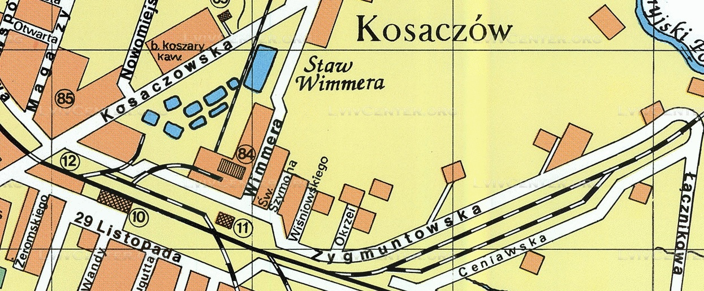

# Wstęp

Album tematycznie obejmuje osoby i wydarzenia związane z rodziną Junger, zamieszkującą Kołomyję w latach międzywojennych.

Materiały zawarte w niniejszym albumie pochodzą głównie ze zbiorów Edwarda Jungera i są obecnie przechowywane u jego syna Jerzego Jungera

Pomysł na stworzenie niniejszego albumu powstał dzięki bliskim kontaktom z moją Rodziną, której głównym ogniwem był Edward Junger.

Wybór zdjęć i dobór komentarzy:

- Jerzy Junger, syn Edwarda Jungera: komentarze oraz wszystkie zdjęcia rodzinne.
- Sławomir Siudek [SS], wnuk Edwarda Jungera: kompilacja materiału, dodatkowe źródła archiwalne
- Janka Gapińska [JG], młodsza córka Rudolfa Jungera: komentarze

"Człowiek żyje tak długo, aż nie zginie po nim pamięć."

Edycję albumu zakończono grudzień 2020r.

# RODZINA JUNGER

Rodzina Junger pochodzi z Kołomyi na terenie dzisiejszej Ukrainy.

W roku 1946 Anna Junger z córką Stefanią Hamaluk oraz wnuczką Halinką przenoszą się na tzw. ziemie odzyskane, czyli zamieszkują w Trzciance, gdzie dołącza do nich Edward Junger.
Dom pod adresem Konarskiego 3 w Trzciance był jednym z wielu domów opuszczonych przez Niemców zmuszonych do wyjazdu z nowych terenów polskich, i stał się docelowo nowym rodzinnym domem Jungerów.

