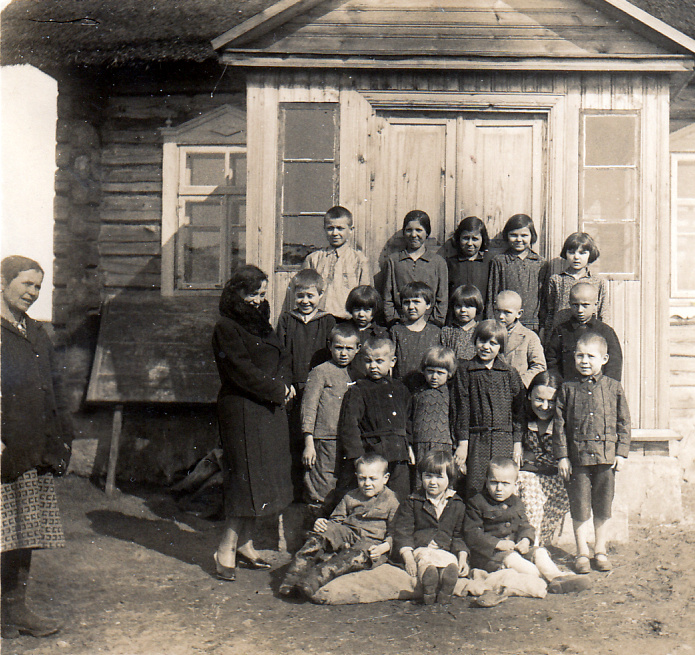
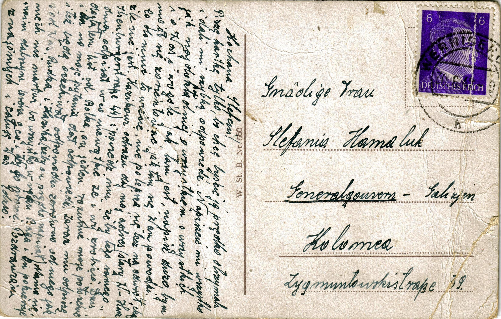
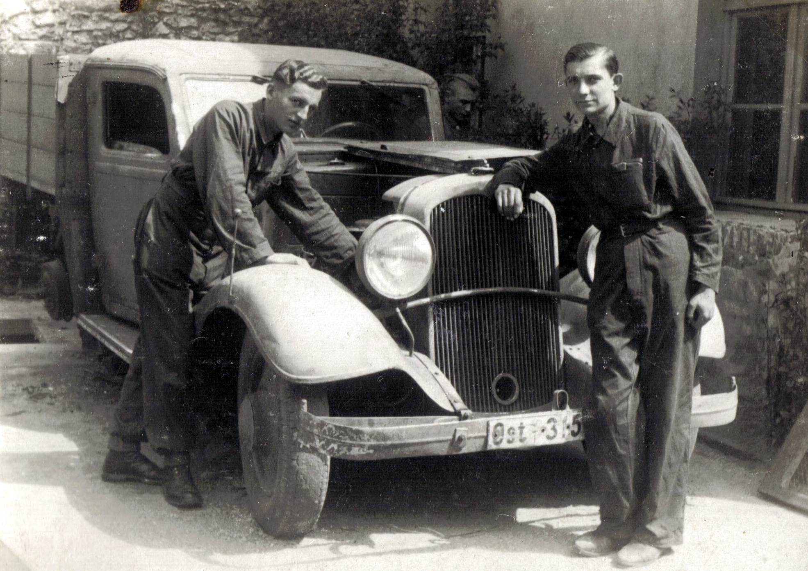

# Wstęp

Album tematycznie obejmuje osoby i wydarzenia związane z rodziną Junger, zamieszkującą Kołomyję w latach międzywojennych.

Materiały zawarte w niniejszym albumie pochodzą głównie ze zbiorów Edwarda Jungera i są obecnie przechowywane u jego syna Jerzego Jungera

Pomysł na stworzenie niniejszego albumu powstał dzięki bliskim kontaktom z moją Rodziną, której głównym ogniwem był Edward Junger.

Wybór zdjęć i dobór komentarzy:

- Jerzy Junger, syn Edwarda Jungera: komentarze oraz wszystkie zdjęcia rodzinne.
- Sławomir Siudek [SS], wnuk Edwarda Jungera: kompilacja materiału, dodatkowe źródła archiwalne
- Janka Gapińska [JG], młodsza córka Rudolfa Jungera: komentarze

"Człowiek żyje tak długo, aż nie zginie po nim pamięć."

Edycję albumu zakończono grudzień 2020r.

## Rodzina Junger

Rodzina Junger pochodzi z Kołomyi na terenie dzisiejszej Ukrainy.

W roku 1946 Anna Junger z córką Stefanią Hamaluk oraz wnuczką Halinką przenoszą się na tzw. ziemie odzyskane, czyli zamieszkują w Trzciance, gdzie dołącza do nich Edward Junger.
Dom pod adresem Konarskiego 3 w Trzciance był jednym z wielu domów opuszczonych przez Niemców zmuszonych do wyjazdu z nowych terenów polskich, i stał się docelowo nowym rodzinnym domem Jungerów.

## Anna Junger, z domu Bowszek

---

Urodzona 17 października 1882r niedaleko Kołomyi. Wcześnie straciła matkę która przeziębiła się piorąc bieliznę w rzece. Po śmierci matki jej ojciec Aleksander Bowszek wyjeżdża do Rumunii gdzie prawdopodobnie założył nową rodzinę.

Anna zostaje pod opieką dziadków którzy nazywali się Wokraczka (lub Okraczka). Dziadkowie prowadzili gospodarstwo. Anna kochała dziadków i ciepło o nich opowiadała.

Jedną z jej opowieści z czasów młodości było, jak poszła paść krowy w nowych butach co nie zostało przez dziadka pochwalone. Buty były wtedy cennym dobrem, do noszenia odświętnie.

## Dziadek Wokraczka

---
  
Dziadek Wokraczka wychowuje swoją wnuczkę Annę po śmierci jej matki oraz porzuceniu rodziny przez ojca.

---
  
Pierwsza od prawej Anna Junger, w środku – Dziadek Wokraczka.

## Anna i Franciszek Jungerowie
  
Anna Bowszek wcześnie wydana została za mąż (w wieku 17 lat) za Franciszka Jungera – ślusarza. Franciszek Junger pracował w parowozowni w Kołomyi

Anna z Franciszkiem mieli czwórkę dzieci:

- Stefania Junger
- Rudolf Junger
- Joanna Junger
- Edward Junger

W 1946r. Anna Junger przeprowadziła się ze swoją córką Stefanią oraz wnuczką Halinką do Trzcianki
Zmarła 3 marca 1965 r, pochowana na starym cmentarzu w Trzciance.

## Franciszek Junger

  
Franciszek Junger pracował jako ślusarz kolejowy (taki zawód ojca wpisano w dokumencie chrztu Edwarda Jungera) PKP w Kołomyi. Zginął śmiercią tragiczną 10 października 1930. Został potrącony przez pociąg - wracał do domu z pracy torami kolejowymi, po czym trafił do szpitala ciężko ranny – jedna z nóg została amputowana. Po paru dniach pobytu w szpitalu zmarł. Małżonka Anna, która go odwiedzała w szpitalu w ostatnich dniach wspominała że narzekał na ból nogi której już nie miał.

Zimą 1956 roku Edward Junger pojechał do rodzinnej Kołomyi odwiedzić rodzinne strony. W tym czasie trwały walki na Węgrzech co czyniło podróż niebezpieczną ze względu na potencjalny udział ZSRR w tych walkach (Kołomyja w tym czasie należała do ZSRR). W Kołomyi nie znalazł już grobu ojca Franciszka, znalazł natomiast grób swojego szwagra Romana Hamaluka, męża jego siostry Stefani.

## Stefania Junger

  
Stefania Junger, najstarsza z rodzeństwa Junger, córka Anny i Franiciszka Jungerów, wyszła za mąż za Romana Hamaluka w Kołomyi.
Na zdjęciu Stefania Hamaluk z jedyną córką Haliną (Halina, później po mężu Ciećkowska) na tle nieistniejącego dzisiaj Mauzoleum Żołnierzy Radzieckich w Trzciance przy Placu Pocztowym. Na dalszym tle rozebrany w 1964r. kościół ewagelicki.

Po przybyciu z rodzinnej Kołomyi do Trzcianki nie miała dłuższy czas pracy i mieszkała z bratem Edwardem i jego rodziną w Trzciance Konarskiego 3. Po paru latach dostała pracę w trzcianeckim domu opieki społecznej dla dorosłych przy ul. Daszyńskiego (dziś 27 Stycznia).

W latach 50-tych Stefania przenosi się ze swoją mamą Anną i córką Halinką do mieszkania przy ul. Pilskiej 13 w Trzciance, należącego do jej brata Rudolfa Junger. Rudolf miał duże mieszkanie gdzie mieszkał w tym czasie ze swoją żona Honoratą. Mieszkała tam do 1965r.

  
W 1960r. córka Stefani – Halinka – wychodzi za mąż za Ryszarda Ciećkowskiego z Piły i mieszkają początkowo wciąż pod adresem Pilska 13.

Gdy umiera Anna Junger w marcu 1965 r., Stefania przeprowadza się do córki Halinki która wcześniej z mężem wyprowadziła się na ul Grunwaldzką.

Halinka i Ryszard Ciećkowscy pracowali w Trzcianeckiej Fabryce Mebli. W związku ze zmianą siedziby zakładu – przeniesienie do Obornik Wielkopolskich - rodzina Ciećkowskich wraz ze Stefanią Hamaluk przenoszą się razem do Obornik Wielkopolskich.

2 września 1978r. Stefania umiera w Obornikach i tam zostaje pochowana. Córka jej Halina wraz z mężem Ryszardem wracają później do Trzcianki (ponieważ siedziba firmy zostaje ponownie przeniesiona do Trzcianki), czego efektem jest że grób Stefanii w Obornikach jest jedymy grobem rodzinnym w tej miejscowości mimo że nie ma tam obecnie żadnego członka rodziny.

Tuż przed wyjazdem rodziny Jungerów z Kołomyi na ziemie odzyskane został zastrzelony Roman Hamaluk, mąż Stefani. W roku 1956 jego Edward Junger odnalazł grób Romana na cmentarzu w Kołomyi.

---
  
Stefania Hamaluk (z domu Junger) oraz jej mąż Roman Hamaluk

## Rudolf Junger

  
Rudolf Junger, przez kolegów zwany „Anglikiem z Kołomyi”, co wiemy z widokówki którą jeden z jego kolegów zaadresował z życzeniami.

Urodzony 12.04.1904 Gwoździec k. Kołomyi
Chodził do gimnazjum Żołnierza Polskiego w Kołomyi. Ukończył IV klasę.
Zatrudniony w PKP w Kołomyi 01.10.1923 z przerwą na dwuletnią służbę wojskową
23.05.1927, po odbyciu służby wojskowej, zatrudniony w PKP Załucze Śniatyń jako asystent oddziału celnego
Po wkroczenia Rosjan we wrześniu 1939 r.,  zwolniony z pracy na stacji kolejowej, pracował z Hucułami przy wyrębie lasu w górach. Pomagał też swojemu teściowi Józefowi Biesiadeckiemu w pracy na polu. W tym czasie, od początku wakacji w 1939, najbliższa rodzina Rudolfa (żona, dzieci) przebywali u jego teściów - Anny i wspomnianego wcześniej Józefa Biesiadeckich 
Na początku lat 40 zatrudnił się na PKP w Kołomyi, gdzie mieszkał z Babcią Anną. Najbliższa rodzina: córki – Lidia, Janka oraz żona Honorata – pozostały w Rudnikach. Przeniosły się do Rudolfa do Kołomyi od września 1944 i tam obie córki uczęszczały do Polskiej Szkoły.

  
W ramach repatriacji w lipcu 1945 Rudolf z żoną i córkami wyjeżdża do Polski, gdzie zamieszkują w Trzciance od 15 sierpnia 1945.

Rudolf Junger zatrudniony zostaje w połowie 1945 w PKP w Trzciance, a następnie przeniesiony do Gubina z uwagi na jego uprawnienia celne. Tam zachorował.

W szpitalu przebywa od 02.03.1952, po czym umiera 16 marca 1952 w Instytucie Onkologii w Gliwicach.

Zmarł w Gliwicach w Instytucie Onkologii 16.03.1952.

Pochowany na starym cmentarzu w Trzciance

---
  
Rudolf Junger z małżonką Honoratą (z domu Biesiadecka)

---
  
Rudolf Junger

### Rudolf Junger - rodzina

---
  
Żona Rudolfa – Honorata (z domu Biesiadecka) – z ich starszą córką Lidką (po mężu: Lidia Pisarska).

---
  
Druga córka Rudolfa i Honoraty, Janina.
Wiele lat później Jako Janina Gapińska, małżonka Czesława Gapińskiego, zamieszkała w Koszalinie. Zdjęcie datowane 7 września 1937r.

---
  
Rudolf zmarł 16 III 1952 r. Na zdjęciu pochód pogrzebowy Rudolfa Jungera w Trzciance. Z białą laską w pochodzie Anna Junger (matka Rudolfa) wspierająca się na ramieniu jego brata Edwarda.

# Joanna Junger

  
Joanna, zwana w rodzinie Hasią, była trzecim dzieckiem Anny i Franciszka Jungerów.

Hasia, jako dorosła osoba, zamieszkała z daleka od rodzinnej Kołomyi w Dziewiętnie powiat Wilejski, gmina Żodziszki, na terenie dzisiejszej Białorusi. Zmarła bezdzietnie.

  
Jedyne materiały jakie zostały po jej śmierci (zdjęcia) przywiozła po jej pogrzebie siostra Stefania, po smieci Stefani zaś jej wnuczka – Alicja – przekazała materiały Renacie, córce Edwarda Jungera, która z kolei przekazała je Marii (swojej siostrze) i stąd trafiają do tego albumu.

---
  
  
Nie wiemy dlaczego Hasia zdecydowała wyjechać z Kołomyi i mieszkać i pracować w Dziewiętnie, leżącej 900 km dalej. To było zapewne w latach 192X, gdzie przeprowadzka do dalekiej wsi zapewne była niełatwa logistycznie

Skąd Hasia wiedziała że jest tam praca?

Co skłoniło ją do wyjazdu z w miarę nowoczesnego miasta Kołomyi do wsi „na końcu świata”?

Czy prawdą jest, że zmarła w Dziewiętne przy porodzie? 

Gdzie znajduje się jej grób, o ile jeszcze istnieje? Nie wiemy …

Na jej pogrzeb w latach 193X z rodziny pojechała wyłącznie siostra Stefania, przywożąc ze sobą heh rzeczy osobiste, włączając zdjęcia które właśnie przeglądasz w albumie.

  
Karta z życzeniami dla Joanny Jungerówny od jej ucznia Koscia i "Ceść" od Zbyszka (zapewne ojca tegoż ucznia), datowana 12/V/1931r.

  
Karta wysłana z Kołomyi powala przypuścić że Hasia wczesniej uczyła przez jakiś czas w Kołomyi zanim przeniosła się do Dziewiętni. Jej uczniowie i ich rodzice pamiętali o niej.

  
Hasia z uczniami w Dziewiętniach.

  
Hasia mieszkała w Dziewiętniach co najmniej do 20 IV 1933, gdyż jedno ze zdjęć (nie umieszczone w albumie ze względu na niską jakość) jest podpisane ‘Dziewiętnia’ i tak datowane.

  
Hasia Junger, prawdopodobnie w pracy, w szkole - Kołomyi lub Dziewiętnie.

  
Hasia Junger, prawdopodobnie w pracy, w szkole - Kołomyi lub Dziewiętnie.

  
Hasia Junger, prawdopodobnie w pracy, w szkole - Kołomyi lub Dziewiętnie.

## Edward Junger

  
Edward Stanisław Junger, najmłodsze czwarte dziecko Anny Junger (z domu Bowszek) oraz Franciszka Jungera.

  
Starsze rodzeństwo:
Rudolf Junger
Stefania Junger

  
Życiorys

Urodziłem się 11 lutego 1919 roku w Kołomyi województwo Stanisławowskie. Ojciec Franciszek pracował jako funkcjonariusz PKP w Kołomyi. Zginął śmiercią tragiczną 10 października 1930 roku. Matka Anna (Bowszek) po śmierci ojca żyła z emerytury. Zmarła w Trzciance 3 marca 1965 roku. Do szkoły powszechnej zacząłem uczęszczać w 1927 roku w Kołomyi. Naukę w gimnazjum zacząłem w 1933 roku. Liceum fizyczno – matematyczne ukończyłem w 1939 roku w kołomyi.

Po zajęciu terenów wschodnich przez Związek Radziecki zacząłem pracować jako księgowy (buchalter) w Powiatowym Związku Cegielni w Kołomyi gdzie pracowałem do chwili wybuchu wojny niemiecko – rosyjskiej w 1941 roku. (1.1.1940 – 30.6.1941)

Podczas okupacji niemieckiej zostałem aresztowany i wywieziony do Wernigerode gdzie pracowałem w odlewni. Z Niemiec uciekłem w 1942 roku i przebywałem u krewnych w Krakowie.

W 1943 roku powróciłem do Kołomyi gdzie ukrywałem się aż do przyjścia Armii Czerwonej. Po zajęciu tych terenów przez Armię Czerwoną brałem udział w walkach z bandami ukraińskimi w „Lotnym Batalionie” przy NKWD w Kołomyi. W maju 1944 roku zgłosiłem się na ochotnika do Wojska Polskiego i wyjechałem do Żytomierza, gdzie zostałem przyjęty 1.6.1944 roku.

  
W wojsku brałem udział w walkach o Wał Pomorski, nad Odrą w rejonie Szczecina i później w rejonie Drezna. Po zakończeniu wojny i powrocie naszej dywizji do Ostrowa Wielkopolskiego zostałem zdemobilizowany w styczniu 1946 roku. Po zdemobilizowaniu przyjechałem do Trzcianki gdzie zamieszkiwała moja rodzina repatriowana z Kołomyi.

Pracować zacząłem już 1.2.1946 roku w Powiatowym Komitecie Opieki Społecznej w Trzciance jako księgowy. Placówkę powyższą zlikwidowano w maju 1949 roku. Od tego czasu podjąłem pracę jako księgowy a później jako kierownik sekcji księgowości Powiatowego Związku Gminnych Spółdzielni w Trzciance gdzie pracowałem do 1go kwietnia 1956 roku.

1go kwietnia 1956 roku objąłem stanowisko głównego księgowego Powszechnej Spółdzielni Spożywców w Trzciance gdzie pracuję do chwili obecnej.

W 1946 roku zawarłem związek małżeński z Haliną Zawieja. W chwili obecnej rodzina moja składa się z żony i trojga dzieci

Junger Edward  
Trzcianka Lub.  
Konarskiego 3

---
  
Trzcianka 25.4.1987  
Edward Junger  
Trzcianka Lub  
Konarskiego 3

Życiorys

Urodziłem się 11 lutego 1919 roku w Kołomyji. Tam uczęszczałem do szkoły powszechnej, gimnazjum i tam ukończyłem liceum fizyczno-matematyczne w 1939 roku. Pracować zacząłem w 1940 roku w fabryce ceramicznej w Kołomyji jako księgowy do chwili wybuchu wojny rosyjsko – niemieckiej w 1941 roku.
Po zajęciu Kołomyji pracowałem nadal w tej samej fabryce aż do chwili aresztowania mnie i wywiezienia do obozu przy fabryce w Wernigerode w górach Herz.
W 1942 roku uciekłem z Wernigerode do Krakowa i w okolicach Krakowa-Miechowa przebywałem do czerwca 1943 roku.
W czerwcu 1943 roku wróciłem do Kołomyji, gdzie wstąpiłem do organizacji AK, i zostałem przydzielony do oddziału tej organizacji. Będąc członkiem tej organizacji, Oddziału brałem udział w różnych akcjach przeciwko niemcom i banderowcom (wykonanie wyroku na burmistrzu miasta Kołomyji itp.) Z chwilą wejścia do Kołomyji wojska radzieckich Oddział nasz został wcielony do NKWD w Kołomyji i przybrał nazwę „lotnego batalionu”.
W Lotnym Batalionie brałem udział w dalszym ciągu w walkach z bandami ukraińskimi do końca kwietnia 1944 roku. Od 6 maja 1944 roku służyłem w Ludowym ….

---
  
Wojsku Polskim do chwili demobilizacji tj. 5 stycznia 1946 roku.  
Służąc w wojsku brałem w walkach o Wał Pomorski w rejonie Szczecina a później Drezna. W okrążenie wpadliśmy pod Budziszynem gdzie też zastał nas koniec wojny.  
Do końca lipca przebywaliśmy na terenie Niemiec a później stacjonowaliśmy w Ostrowie Wlkp.  
Zostałem zdemobilizowany 5 stycznia 1946 roku a od 1 lutego 1946 roku rozpocząłem pracę jako księgowy w Pow. Komitecie Opieki Społecznej w Trzciance.  
W 1946 roku ożeniłem się i w chwili obecnej mam troje dzieci.
30.5.1949 została zlikwidowana w/w instytucja i od 1.4.1949 roku zacząłem pracować w Powiatowym Związku Gminnych Spółdzielni w Trzciance jako kierownik księgowości.  
1.4.1956 roku przeszedłem z PZGS-u do Powszechnej Spółdzielni Spożywców w Trzciance na stanowisko gł. Księgowego.  
Z chwilą reorganizacji zostałem przeniesiony do WSS-u w Pile na stanowisko kierownika biura księgowości i finansów gdzie pracuję dotychczas.

---
  
Powyższe zdjęcie opublikował na grupie internetowej Kołomyja Info jeden grupowicz *Mieczysław Lewandowski* z informacją *"Kołomyja. 7 czerwca 1931 r. Uroczystość Komunii Św.  Dom parafialny (zniszczony w czasie wojny). U góry Bogusława Budzianowska i Halina Sosnowska"*. Z innej informacji, na forum tej samej grupy, dowiedziałem się, że duchowny w środku to *"ks.Gwardian Eugeniusz Węgrzyn"*.  
Zdjęcie publikuję jako - w mojej ocenie - wykonane w czasie tej samej uroczystości co znajdujące się w naszych rodzinnych zbiorach, umieszczone poniżej.

---
  
Edward Junger: środkowy rząd, czwarty od prawej.

---
  
Zdjęcie nr 1 strona A - prawdopodobnie z legitymacji szkolnej.

---
  
Widzimy na drugiej stronie prawdziwą datę urodzenia: 11.II.1922. Edward Junger zataił swój młody wiek aby zostać przyjęty do wojska, zmienił zatem konsekwentnie swoją datę urodzenia na 1919 rok aby się postarzeć o 3 lata. Zatem we wszystkich pozostałych dokumentach znajdziecie oficjalną datę urodzenia podaną jako 11.II.1919.
Widzimy jego drugie imię – Stanisław
Widzimy przekreślony wyraz „syn” i zapisane obok „sierota”

---
  
Zdjęcie nr 2

---
  
Na drugiej stronie zdjęcia prawdopodobnie napis „ … wdowy po em. kowalu” co. Włącznie z innymi informacjami pozwala domniemać że ojciec Franciszek, pracując na kolei, zajmował się pracami ślusarskimi.

---
  
Edward Junger, aresztowany i wywieziony przez Niemców z Kołomyi do obozu Wernigerode
Pracowali w ciężkich warunkach bez ubrań ochronnych przy pracach hutniczych. Edward opowiadał że bolały go oczy od patrzenia na roztopiony metal.
Pracował kilka miesięcy, planował ucieczkę. Miało ich uciekać w sumie 7 osób.  Jednakże 6 ciu rozmyśliło i ucieczkę wykonał tylko Edward.
Ucieczka powiodła się dzięki pomocy miejscowej Niemki, widocznej na zdjęciu jako druga z prawej strony, która dostarczyła ubranie, pieniądze i dokumenty.

---
  
Bez przeszkód Edward dojechał prawie do Częstochowy gdzie znajdowała granica z Generalnym Gubernatorstwem. Granicę przekroczył nielegalnie koło miejscowości Herby Stare.
Podczas przekraczania strażnik dojrzał go i puścił psy w pościg. Edward przedzierał się przez głębokie rozlewiska i jeden pies płynął ciągle za Edwardem, który musiał go utopić.

---
  
List z obozu od Edwarda do jego siostry Stefani Hamaluk, Kołomyja ul. Zygmuntowska 39, datowany 30.6.1942

---
  
*"Kochana Stefciu! Piszę kartkę tylko, bo chcę byście ją prędko otrzymali i dali mi szybką odpowiedź. Napiszcie mi wszystko jak najdokładniej o wszystkiem o wszystkich i o Was i w ogóle jak tam jest, napisz dużo bym mógł zorientować jak tam się Wam powodzi. Co do mnie to wiecie, nie polepsza się lecz na odwrót, choć źle nie jest. Kazikowi od razu daj mój adres (stary W. Harz Ilsenburger Straße 44) i powiedz mu żeby tego samego dnia odpisał w co nie wątpię że i wy zrobicie. Dziś dostałem list od Bolka, on jeden rozumie moje położenie i on na moje pytania dał odpowiedź. Zaraz mu odpiszę i tez będę oczekiwał odpowiedzi zarówno od niego, od Was jak i Rudka i Kazika  (żeby on prędko napisał). Mama się niech nie martwi, bo wszystko w ręku Boga i On pokieruje moim dalszym losem o co i Wy go proście. Pozdrawiam znajomych i całuję Was Edzio."*

---
  
Zdjęcie zapewne z Kołomyi. Z tyłu na tyle charakterystyczny budynek że być może możliwy do zidentyfikowania. Edward Junger z lewej strony.

---
  
  
Na zdjęciu powyżej – Edward Junger z lewej stron, poniżej podpis z drugiej strony zdjęcia.
PS: Edward na mechanice samochodowej się nie znał, więc zdjęcie zapewnie pozowane :)

Zagadkowe zdjęcie, ponieważ:

1) Rejestracja wskazuje na samochód Dystryktu Lubelskiego Generalnego Gubernatora, który nie obejmował Kołomyi
2) Zdjęcie datowane po drugiej stronie na 15.V.42, kiedy w tym czasie Edward był ścigany jako uciekinier po ucieczce z Wernigerode.

Wniosek: Zakładam, że data i opis nie odpowiadają treści zdjęcia.
To zdjęcie, jak i następne 4 zdjęcia pochodzą zapewne z tego samego okresu / miejsca - prawdopodobnie Kołomyja 1941r, po wkroczeniu Niemców, zaś przed aresztowaniem i wywózką Edwarda do Wernigerode

---
  
Edward Junger pierwszy z lewej strony, opierający się o maskę samochodu.

---
  
Edward Junger drugi od prawej strony.

---
  
Edward Junger trzeci od lewej strony.

---
  
Na zdjęciu kadra (kierownicza? nauczycielska?) związana z poprzednimi czterema zdjęciami

---
  
Na zdjęciu widoczny pomnik Adama Mickiewicza w Kołomyi, istniejący do dzisiaj.

---
  
Pomnik został właśnie zdobyty przez Edwarda Jungera (rozpostarty na szczycie pomnika), wraz z jego towarzyszami.

---
  
Edward Junger (pierwszy z prawej strony) przywiózł z Kołomyi swoje narty do Trzcianki mając nadzieję że będzie mógł z nich w przyszłości korzystać. Niestety w rejonie Trzcianki nie miał z nich pożytku ze względu na uwarunkowania terenowe – dużo wody, mało pagórków.

