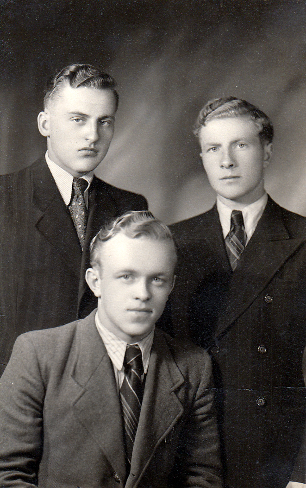

## Rodzina Junger

***"Człowiek żyje tak długo, aż nie zginie po nim pamięć."***

Edycję albumu zakończono w maju 2021 roku.

Album tematycznie obejmuje osoby i wydarzenia związane z rodziną Junger, zamieszkującą Kołomyję w latach międzywojennych.

Materiały zdjęciowe zawarte w niniejszym albumie pochodzą głównie ze zbiorów Edwarda Jungera i są obecnie przechowywane obecnie u jego syna Jerzego Jungera.

Pomysł na stworzenie niniejszego albumu powstał dzięki bliskim kontaktom z moją Rodziną, której głównym ogniwem był Edward Junger.

Wybór zdjęć i dobór komentarzy:

- Jerzy Junger, syn Edwarda Jungera: komentarze oraz wszystkie zdjęcia rodzinne.
- Sławomir Siudek [SS], wnuk Edwarda Jungera: kompilacja materiału, dodatkowe źródła archiwalne lub internetowe
- Janka Gapińska [JG], młodsza córka Rudolfa Jungera: część komentarzy dotycząca rodzinu Junger

---
Rodzina Junger pochodzi z Kołomyi na terenie dzisiejszej Ukrainy.

We wspomnieniach Eugeniusza Dmytrów "Ocalić od Zapomnienia Kosaczów - dzielnica Kołomyi" w bogatym opisie dzielnicy międzywojennej Kołomyi - Kosaczowa - znajdujemy, wśród opisu mieszkańców tej dzielnicy, zapis: "*Ulica boczna Zygmuntowskiej. Junger – syn Edward. Edzio Junger (1923) ukończył przed wojną trzecią klasę gimnazjalną KKJ. Postać znana w kręgach gimnazjalnych, harcerskich i środowiskowych. Osiadł w Trzciance.*" Podana w opisie data - 1923 - datą urodzenia (dość dokładną, faktycznie powinno być 1922), zaś KKJ to skrót of kołomyjskiego liceum i gimnazjum im. Króla Kazimierza Jagiellończyka.

W 1945 roku, wagonem towarowym, przyjeżdża na stałe z Kołomyi do Trzcianki (na tak zwane Ziemie Odzyskane) rodzina Jungerów. Wagonem tym jedzie 14 osób wraz z ich całym dobytkiem zabranym do Polski. Między innymi jadą: seniorka rodu Anna Junger, jej córka Stefania Hanaluk (z domu Junger), córka Stefani Halinka Hamaluk, najstarszy syn Anny - Rudolf Junger oraz rodzina Rudolfa: żona Honorata Junger (z domu Biesiadecka) oraz córki Lidka i Janina. Stefania wyjeżdża do Polski bez swojego męża Romana Hamaluka ponieważ w marcu 1945 roku w Kołomyi przed repatriacją został on zamordowany. Roman Hamaluk był listonoszem. *[JG] Pamiętam, ciocia Stefa szukała go cały dzień z milicją gdy nie wrócił wieczorem do domu w końcu ktoś zawiadomił milicję, że ktoś leży w rowie zastrzelony. Pamiętam dokładnie pogrzeb wujka Romana Hamaluka*.

Edward Junger ze swoim przyjacielem Tadeuszem Trzcińskim pod koniec wojny stacjonowali z wojskiem polskim w Ostrowiu Wielkopolskim, gdzie poznali siostry Halinę i Henrykę Zawiejanki które zostały potem ich żonami. Halina żoną Edwarda Jungera, Henryka zaś żoną Tadeusza Trzcińskiego. Edward i Halina ślub wzięli w 1946 roku w Ostrowie Wielkopolskim *[JG] Moi rodzice byli na ślubie*. Do Trzcianki Edward przyjechał po zdemobilizownaiu. W 1946 roku zamieszkali w Trzciance na ul. Pilskiej nr 9, na krótko. Następnie na Konarskiego 3.

[MS] Edward Junger wraz ze swoją żoną Haliną zamieszkali po ślubie w początkowo w wynajętym mieszkaniu w Trzciance na ulicy Pilskiej 10 jako sublokator  u państwa Nene na parterze (przydział dnia 8/10/1946r). Halina dowiedziała się, że Edwardowi, jako repatriantowi i żołnierzowi przysługuje kupno domu. Edward otrzymał dom pod adresem Konarskiego 3 ok 1953 roku oraz kawałek ziemi oddanej w uprawę. Do nowego domu wprowadził się Edward z żoną i dziećmi, oraz swoją mamą Anną oraz siostrą Stefanią wraz z jej córką - Halinką. Było to chyba już po śmierci Rudolfa (zmarł w 1952 roku) u którego do tej pory mieszkały Anna, Stefania i Halinka, i być może Anna Junger wolała chyba przeprowadzić się i być blisko swojego drugiego syna - Edwarda.

Dom pod adresem Konarskiego 3 w Trzciance był jednym z wielu domów opuszczonych przez Niemców zmuszonych do wyjazdu z nowych ziem polskich, i stał się na wiele lat nowym rodzinnym domem Jungerów.

Mapa Kołomyi z czasów międzywojennych

### Anna Junger, z domu Bowszek

---

Urodzona 17 października 1882r niedaleko Kołomyi. Wcześnie straciła matkę która przeziębiła się piorąc bieliznę w rzece. Po śmierci matki jej ojciec Aleksander Bowszek wyjeżdża do Rumunii gdzie prawdopodobnie założył nową rodzinę.

Anna zostaje pod opieką dziadków którzy nazywali się Wokraczka (lub Okraczka). Dziadkowie prowadzili gospodarstwo. Anna kochała dziadków i ciepło o nich opowiadała.

Jedną z jej opowieści z czasów młodości było, jak poszła paść krowy w nowych butach co nie zostało przez dziadka pochwalone. Buty były wtedy cennym dobrem, do noszenia odświętnie.

## Dziadek Wokraczka

---
  
Dziadek Wokraczka wychowuje swoją wnuczkę Annę po śmierci jej matki oraz porzuceniu rodziny przez ojca.

---
  
Pierwsza od prawej Anna Junger, w środku – Dziadek Wokraczka.

## Anna i Franciszek Jungerowie

  
Anna Bowszek wcześnie wydana została za mąż (w wieku 17 lat) za Franciszka Jungera – ślusarza. Franciszek Junger pracował w parowozowni w Kołomyi

Anna z Franciszkiem mieli czwórkę dzieci:

- Stefania Junger
- Rudolf Junger
- Joanna Junger
- Edward Junger

W 1946r. Anna Junger przeprowadziła się ze swoją córką Stefanią oraz wnuczką Halinką do Trzcianki
Zmarła 3 marca 1965 r, pochowana na starym cmentarzu w Trzciance.

## Franciszek Junger

  
Franciszek Junger pracował jako ślusarz kolejowy (taki zawód ojca wpisano w dokumencie chrztu Edwarda Jungera) PKP w Kołomyi. Zginął śmiercią tragiczną 10 października 1930. Został potrącony przez pociąg - wracał do domu z pracy torami kolejowymi, po czym trafił do szpitala ciężko ranny – jedna z nóg została amputowana. Po paru dniach pobytu w szpitalu zmarł. Małżonka Anna, która go odwiedzała w szpitalu w ostatnich dniach wspominała że narzekał na ból nogi której już nie miał.

Zimą 1956 roku Edward Junger pojechał do rodzinnej Kołomyi odwiedzić rodzinne strony. W tym czasie trwały walki na Węgrzech co czyniło podróż niebezpieczną ze względu na potencjalny udział ZSRR w tych walkach (Kołomyja w tym czasie należała do ZSRR). W Kołomyi nie znalazł już grobu ojca Franciszka, znalazł natomiast grób swojego szwagra Romana Hamaluka, męża jego siostry Stefani.

## Stefania Junger

Stefania Junger, najstarsza z rodzeństwa Junger, córka Anny i Franiciszka Jungerów, wyszła za mąż za Romana Hamaluka w Kołomyi który został zamordowany w marcu 1945 roku przed wyjazdem Jungerów z Kołomyi.
Na zdjęciu Stefania Hamaluk z jedyną córką Haliną (Halina, później po mężu Ciećkowska) na tle nieistniejącego dzisiaj Mauzoleum Żołnierzy Radzieckich w Trzciance przy Placu Pocztowym. Na dalszym tle rozebrany w 1964r. kościół ewagelicki.

Tuż przed wyjazdem rodziny Jungerów z Kołomyi na ziemie odzyskane został zastrzelony Roman Hamaluk, mąż Stefani. JJ: *W roku 1956 jego Edward Junger odnalazł grób Romana na cmentarzu w Kołomyi.*

Po przybyciu z rodzinnej Kołomyi do Trzcianki nie miała dłuższy czas pracy i mieszkała z bratem Edwardem i jego rodziną w Trzciance Konarskiego 3. Po paru latach dostała pracę w trzcianeckim domu opieki społecznej dla dorosłych przy ul. Daszyńskiego (dziś 27 Stycznia).

Na początku lat 50-tych Stefania przenosi się ze swoją mamą Anną i córką Halinką do brata Edwarda na Konarskiego 3. Po kilku latach mieszkania u Edwarda ponownie wracają do mieszkania przy ulicy Pilskiej 13 w Trzciance gdzie mieszkała sama jej synowa Honorata (żona zmarłego Rudolfa). Byo to duże mieszkanie i Stefania, Anna i Halinka zamieszkały na pierwszym piętrze.

  
W 1960r. córka Stefani – Halinka – wychodzi za mąż za Ryszarda Ciećkowskiego z Piły i mieszkają początkowo wciąż pod adresem Pilska 13. Potem Halinka z mężem przenoszą się na ul. Daszyńskiego (aktualnie: ul. 27 stycznia) gdzie otrzymali mieszkanie w bloku (pokój, kuchnia, łazienka)

Gdy umiera Anna Junger w marcu 1965 r., Stefania przeprowadza się do córki Halinki która w tym czasie z mężem mieszkała już na ulicy Grunwaldzkiej.

Halinka i Ryszard pracowali w Fabryce Mebli w Trzciance. W związku z reorganizacją Fabryki Mebli - przeniesienie do Obornik Wielkopolskich - rodzina Ciećkowskich wraz ze Stefanią Hamaluk przenoszą się razem do Obornik Wielkopolskich. JJ: *Chwilowo Ciocia Stefa z najmłodszą córką Halinki - Magdą - zamieszkała w Trzciance na Konarskiego 3 u swego brata Edwarda tak aby Magda dokończyła rok szkolny i potem przeniosły się również do Obornik i zamieszkały przy ul. Kopernika.*

2 września 1978 ciocia Stefa zmarła w Obornikach i tam jest pochowana. Córka Halinka wraz z mężem Ryszardem ponownie wracają do Trzcianki (ponieważ siedziba firmy zostaje ponownie przeniesiona do Trzcianki) gdzie dalej pracowali w Fabryce Mebli. Grób cioci Stefy pozostał w Obornikach samotnie i obecnie nie mieszka tam nikt z jej rodziny.

---
  
Stefania Hamaluk (z domu Junger) oraz jej mąż Roman Hamaluk

## Rudolf Junger

  
Rudolf Junger, przez kolegów zwany „Anglikiem z Kołomyi”, co wiemy z widokówki którą jeden z jego kolegów zaadresował z życzeniami.

Rudolf Junger urodzony 12.04.1904 rok Gwoździec k. Kołomyi.
Uczęszczał do gimnazjum Żołnierza Polskiego w Kołomyi. Ukończył IV klasę. W gimnazjum przyjaźnił się z braćmi Antonim i Henrykiem Biesiadeckimi, potem ożenił się z ich siostrą Honoratą.
Zatrudniony w PKP w Kołomyi od 1-go października 1923 roku z przerwą na dwuletnią służbę wojskową. 23.05.1927, po odbyciu służby wojskowej, zatrudniony w PKP Załucze Śniatyń jako asystent oddziału celnego.

Po wkroczenia Rosjan we wrześniu 1939 r., zwolniony z pracy na stacji kolejowej, pracował z Hucułami przy wyrębie lasu w górach. Pomagał też swojemu teściowi Józefowi Biesiadeckiemu w pracy na polu. W tym czasie, od początku wakacji w 1939, najbliższa rodzina Rudolfa (żona, dzieci) przebywali u jego teściów - Anny i wspomnianego wcześniej Józefa Biesiadeckich
Na początku lat 40 zatrudnił się na PKP w Kołomyi, gdzie mieszkał ze swoją mamą Anną. Najbliższa rodzina: córki – Lidia, Janka oraz żona Honorata – pozostały w  czasie okupacji w Rudnikach u dziadków Biesiadeckich. Przeniosły się do Rudolfa do Kołomyi od września 1944, i tam obie córki uczęszczały do polskiej szkoły.  
W sierpniu 1945 roku Rudolf Junger przyjeżdża z rodziną wagonem towarowym z Kołomyi do Trzcianki wraz ze swoim dobytkiem. Wraz z nim do Trzcianki wyjeżdżają na stałe jego żona Honorata, ich córki Lidzia i Janka, jego mama Anna Junger, siostra Stefania Hamaluk (Junger) oraz jej córka Halinką. Po przybyciu do Trzcianki szukają domu, w końcu zamieszkują przy ulicy Pilskiej: Rudolf i Honorata z córkami na parterze (3 pokoje), zaś mama Anna Junger, siostra Stefa Hamaluk (Junger) i jej córka Halinka na pierwszym piętrze (1 pokój).

  
W ramach repatriacji w lipcu 1945 Rudolf z żoną i córkami wyjeżdża do Polski, gdzie zamieszkują w Trzciance od 15 sierpnia 1945.

Rudolf Junger zatrudniony zostaje w połowie 1945 w PKP w Trzciance, a następnie przeniesiony do Gubina z uwagi na jego uprawnienia celne. Tam zachorował.

W szpitalu przebywa od 02.03.1952, po czym umiera 16 marca 1952 w Instytucie Onkologii w Gliwicach.

Zmarł w Gliwicach w Instytucie Onkologii 16.03.1952.

Pochowany na starym cmentarzu w Trzciance

---
  
Rudolf Junger z małżonką Honoratą (z domu Biesiadecka)

---
  
Rudolf Junger

### Rudolf Junger - rodzina

---
  
Żona Rudolfa – Honorata (z domu Biesiadecka) – z ich starszą córką Lidką (po mężu: Lidia Pisarska).

---
  
Druga córka Rudolfa i Honoraty, Janina.
Wiele lat później jako Janina Gapińska, małżonka Czesława Gapińskiego, zamieszkała w Koszalinie. Zdjęcie datowane 7 września 1937r.

---
  
Rudolf zmarł 16 III 1952 r. Na zdjęciu pochód pogrzebowy Rudolfa Jungera w Trzciance. Z białą laską w pochodzie Anna Junger (matka Rudolfa) wspierająca się na ramieniu jego brata Edwarda.

## Joanna Junger

  
Joanna, zwana w rodzinie Hasią, była trzecim dzieckiem Anny i Franciszka Jungerów.

Hasia, jako dorosła osoba, zamieszkała z daleka od rodzinnej Kołomyi w Dziewiętnie powiat Wilejski, gmina Żodziszki, na terenie dzisiejszej Białorusi. Zmarła bezdzietnie.

  
Jedyne materiały jakie zostały po jej śmierci (zdjęcia) przywiozła po jej pogrzebie siostra Stefania, po smieci Stefani zaś jej wnuczka – Alicja – przekazała materiały Renacie, córce Edwarda Jungera, która z kolei przekazała je Marii (swojej siostrze) i stąd trafiają do tego albumu.

---
  
  
Nie wiemy dlaczego Hasia zdecydowała wyjechać z Kołomyi i mieszkać i pracować w Dziewiętnie, leżącej 900 km dalej. To było zapewne w latach 192X, gdzie przeprowadzka do dalekiej wsi zapewne była niełatwa logistycznie

Skąd Hasia wiedziała że jest tam praca?

Co skłoniło ją do wyjazdu z w miarę nowoczesnego miasta Kołomyi do wsi „na końcu świata”?

Czy prawdą jest, że zmarła w Dziewiętne przy porodzie?

Gdzie znajduje się jej grób, o ile jeszcze istnieje? Nie wiemy …

Na jej pogrzeb w latach 193X z rodziny pojechała wyłącznie siostra Stefania, przywożąc ze sobą heh rzeczy osobiste, włączając zdjęcia które właśnie przeglądasz w albumie.

  
Karta z życzeniami dla Joanny Jungerówny od jej ucznia Koscia i "Ceść" od Zbyszka (zapewne ojca tegoż ucznia), datowana 12/V/1931r.

  
Karta wysłana z Kołomyi powala przypuścić że Hasia wczesniej uczyła przez jakiś czas w Kołomyi zanim przeniosła się do Dziewiętni. Jej uczniowie i ich rodzice pamiętali o niej.

  
Hasia z uczniami w Dziewiętniach.

  
Hasia mieszkała w Dziewiętniach co najmniej do 20 IV 1933, gdyż jedno ze zdjęć (nie umieszczone w albumie ze względu na niską jakość) jest podpisane ‘Dziewiętnia’ i tak datowane.

  
Hasia Junger, prawdopodobnie w pracy, w szkole - Kołomyi lub Dziewiętnie.

  
Hasia Junger, prawdopodobnie w pracy, w szkole - Kołomyi lub Dziewiętnie.

  
Hasia Junger, prawdopodobnie w pracy, w szkole - Kołomyi lub Dziewiętnie.

## Edward Junger

  
Edward Stanisław Junger, najmłodsze czwarte dziecko Anny Junger (z domu Bowszek) oraz Franciszka Jungera.

  
Starsze rodzeństwo:
Rudolf Junger
Stefania Junger

  
Życiorys

Urodziłem się 11 lutego 1919 roku w Kołomyi województwo Stanisławowskie. Ojciec Franciszek pracował jako funkcjonariusz PKP w Kołomyi. Zginął śmiercią tragiczną 10 października 1930 roku. Matka Anna (Bowszek) po śmierci ojca żyła z emerytury. Zmarła w Trzciance 3 marca 1965 roku. Do szkoły powszechnej zacząłem uczęszczać w 1927 roku w Kołomyi. Naukę w gimnazjum zacząłem w 1933 roku. Liceum fizyczno – matematyczne ukończyłem w 1939 roku w kołomyi.

Po zajęciu terenów wschodnich przez Związek Radziecki zacząłem pracować jako księgowy (buchalter) w Powiatowym Związku Cegielni w Kołomyi gdzie pracowałem do chwili wybuchu wojny niemiecko – rosyjskiej w 1941 roku. (1.1.1940 – 30.6.1941)

Podczas okupacji niemieckiej zostałem aresztowany i wywieziony do Wernigerode gdzie pracowałem w odlewni. Z Niemiec uciekłem w 1942 roku i przebywałem u krewnych w Krakowie.

W 1943 roku powróciłem do Kołomyi gdzie ukrywałem się aż do przyjścia Armii Czerwonej. Po zajęciu tych terenów przez Armię Czerwoną brałem udział w walkach z bandami ukraińskimi w „Lotnym Batalionie” przy NKWD w Kołomyi. W maju 1944 roku zgłosiłem się na ochotnika do Wojska Polskiego i wyjechałem do Żytomierza, gdzie zostałem przyjęty 1.6.1944 roku.

  
W wojsku brałem udział w walkach o Wał Pomorski, nad Odrą w rejonie Szczecina i później w rejonie Drezna. Po zakończeniu wojny i powrocie naszej dywizji do Ostrowa Wielkopolskiego zostałem zdemobilizowany w styczniu 1946 roku. Po zdemobilizowaniu przyjechałem do Trzcianki gdzie zamieszkiwała moja rodzina repatriowana z Kołomyi.

Pracować zacząłem już 1.2.1946 roku w Powiatowym Komitecie Opieki Społecznej w Trzciance jako księgowy. Placówkę powyższą zlikwidowano w maju 1949 roku. Od tego czasu podjąłem pracę jako księgowy a później jako kierownik sekcji księgowości Powiatowego Związku Gminnych Spółdzielni w Trzciance gdzie pracowałem do 1go kwietnia 1956 roku.

1go kwietnia 1956 roku objąłem stanowisko głównego księgowego Powszechnej Spółdzielni Spożywców w Trzciance gdzie pracuję do chwili obecnej.

W 1946 roku zawarłem związek małżeński z Haliną Zawieja. W chwili obecnej rodzina moja składa się z żony i trojga dzieci

Junger Edward  
Trzcianka Lub.  
Konarskiego 3

---
  
Trzcianka 25.4.1987  
Edward Junger  
Trzcianka Lub  
Konarskiego 3

Życiorys

Urodziłem się 11 lutego 1919 roku w Kołomyji. Tam uczęszczałem do szkoły powszechnej, gimnazjum i tam ukończyłem liceum fizyczno-matematyczne w 1939 roku. Pracować zacząłem w 1940 roku w fabryce ceramicznej w Kołomyji jako księgowy do chwili wybuchu wojny rosyjsko – niemieckiej w 1941 roku.
Po zajęciu Kołomyji pracowałem nadal w tej samej fabryce aż do chwili aresztowania mnie i wywiezienia do obozu przy fabryce w Wernigerode w górach Herz.
W 1942 roku uciekłem z Wernigerode do Krakowa i w okolicach Krakowa-Miechowa przebywałem do czerwca 1943 roku.
W czerwcu 1943 roku wróciłem do Kołomyji, gdzie wstąpiłem do organizacji AK, i zostałem przydzielony do oddziału tej organizacji. Będąc członkiem tej organizacji, Oddziału brałem udział w różnych akcjach przeciwko niemcom i banderowcom (wykonanie wyroku na burmistrzu miasta Kołomyji itp.) Z chwilą wejścia do Kołomyji wojska radzieckich Oddział nasz został wcielony do NKWD w Kołomyji i przybrał nazwę „lotnego batalionu”.
W Lotnym Batalionie brałem udział w dalszym ciągu w walkach z bandami ukraińskimi do końca kwietnia 1944 roku. Od 6 maja 1944 roku służyłem w Ludowym ….

---
  
Wojsku Polskim do chwili demobilizacji tj. 5 stycznia 1946 roku.  
Służąc w wojsku brałem w walkach o Wał Pomorski w rejonie Szczecina a później Drezna. W okrążenie wpadliśmy pod Budziszynem gdzie też zastał nas koniec wojny.  
Do końca lipca przebywaliśmy na terenie Niemiec a później stacjonowaliśmy w Ostrowie Wlkp.  
Zostałem zdemobilizowany 5 stycznia 1946 roku a od 1 lutego 1946 roku rozpocząłem pracę jako księgowy w Pow. Komitecie Opieki Społecznej w Trzciance.  
W 1946 roku ożeniłem się i w chwili obecnej mam troje dzieci.
30.5.1949 została zlikwidowana w/w instytucja i od 1.4.1949 roku zacząłem pracować w Powiatowym Związku Gminnych Spółdzielni w Trzciance jako kierownik księgowości.  
1.4.1956 roku przeszedłem z PZGS-u do Powszechnej Spółdzielni Spożywców w Trzciance na stanowisko gł. Księgowego.  
Z chwilą reorganizacji zostałem przeniesiony do WSS-u w Pile na stanowisko kierownika biura księgowości i finansów gdzie pracuję dotychczas.

---
  
Powyższe zdjęcie opublikował na grupie internetowej Kołomyja Info jeden grupowicz *Mieczysław Lewandowski* z informacją *"Kołomyja. 7 czerwca 1931 r. Uroczystość Komunii Św.  Dom parafialny (zniszczony w czasie wojny). U góry Bogusława Budzianowska i Halina Sosnowska"*. Z innej informacji, na forum tej samej grupy, dowiedziałem się, że duchowny w środku to *"ks.Gwardian Eugeniusz Węgrzyn"*.  
Zdjęcie publikuję jako - w mojej ocenie - wykonane w czasie tej samej uroczystości co znajdujące się w naszych rodzinnych zbiorach, umieszczone poniżej.

---
  
Edward Junger: środkowy rząd, czwarty od prawej.

---
  
Zdjęcie nr 1 strona A - prawdopodobnie z legitymacji szkolnej.

---
  
Widzimy na drugiej stronie prawdziwą datę urodzenia: 11.II.1922. Edward Junger zataił swój młody wiek aby zostać przyjęty do wojska, zmienił zatem konsekwentnie swoją datę urodzenia na 1919 rok aby się postarzeć o 3 lata. Zatem we wszystkich pozostałych dokumentach znajdziecie oficjalną datę urodzenia podaną jako 11.II.1919.
Widzimy jego drugie imię – Stanisław
Widzimy przekreślony wyraz „syn” i zapisane obok „sierota”

---
  
Zdjęcie nr 2

---
  
Na drugiej stronie zdjęcia prawdopodobnie napis „ … wdowy po em. kowalu” co. Włącznie z innymi informacjami pozwala domniemać że ojciec Franciszek, pracując na kolei, zajmował się pracami ślusarskimi.

---
  
Edward Junger, aresztowany i wywieziony przez Niemców z Kołomyi do obozu Wernigerode
Pracowali w ciężkich warunkach bez ubrań ochronnych przy pracach hutniczych. Edward opowiadał że bolały go oczy od patrzenia na roztopiony metal.
Pracował kilka miesięcy, planował ucieczkę. Miało ich uciekać w sumie 7 osób.  Jednakże 6 ciu rozmyśliło i ucieczkę wykonał tylko Edward.
Ucieczka powiodła się dzięki pomocy miejscowej Niemki, widocznej na zdjęciu jako druga z prawej strony, która dostarczyła ubranie, pieniądze i dokumenty.

---
  
Bez przeszkód Edward dojechał prawie do Częstochowy gdzie znajdowała granica z Generalnym Gubernatorstwem. Granicę przekroczył nielegalnie koło miejscowości Herby Stare.
Podczas przekraczania strażnik dojrzał go i puścił psy w pościg. Edward przedzierał się przez głębokie rozlewiska i jeden pies płynął ciągle za Edwardem, który musiał go utopić.

---
  
List z obozu od Edwarda do jego siostry Stefani Hamaluk, Kołomyja ul. Zygmuntowska 39, datowany 30.6.1942

---
  
*"Kochana Stefciu! Piszę kartkę tylko, bo chcę byście ją prędko otrzymali i dali mi szybką odpowiedź. Napiszcie mi wszystko jak najdokładniej o wszystkiem o wszystkich i o Was i w ogóle jak tam jest, napisz dużo bym mógł zorientować jak tam się Wam powodzi. Co do mnie to wiecie, nie polepsza się lecz na odwrót, choć źle nie jest. Kazikowi od razu daj mój adres (stary W. Harz Ilsenburger Straße 44) i powiedz mu żeby tego samego dnia odpisał w co nie wątpię że i wy zrobicie. Dziś dostałem list od Bolka, on jeden rozumie moje położenie i on na moje pytania dał odpowiedź. Zaraz mu odpiszę i tez będę oczekiwał odpowiedzi zarówno od niego, od Was jak i Rudka i Kazika  (żeby on prędko napisał). Mama się niech nie martwi, bo wszystko w ręku Boga i On pokieruje moim dalszym losem o co i Wy go proście. Pozdrawiam znajomych i całuję Was Edzio."*

---

Fragment mapy miasta Kołomyja z okresu międzywojennego z ulicą Zygmuntowską. Zaznaczone na niej numerowane element oznaczają kolejno (wg opis mapy):

- 10 Dworzec Kolejowy PKP
- 11 Parowozownia
- 12 Stacja Autobusów PKP
- 84 Cegielnia
- 85 Rafineria

Jeżeli rodzina Jungerów mieszkała na Zygmuntowskiej (z widokówki wynika że na Zygmuntowskiej mieszkała przynajmniej siotra Edwarda - Stefania), a Edward (wg jego życiorysu) pracował w Cegielni jako księgowy, to do pracy nie miał chyba daleko.

---
  
Zdjęcie zapewne z Kołomyi. Z tyłu na tyle charakterystyczny budynek że być może możliwy do zidentyfikowania. Edward Junger z lewej strony.

---
  
  
Na zdjęciu powyżej – Edward Junger z lewej stron, poniżej podpis z drugiej strony zdjęcia.
PS: Edward na mechanice samochodowej się nie znał, więc zdjęcie zapewnie pozowane :)

Zagadkowe zdjęcie, ponieważ:

1) Rejestracja wskazuje na samochód Dystryktu Lubelskiego Generalnego Gubernatora, który nie obejmował Kołomyi
2) Zdjęcie datowane po drugiej stronie na 15.V.42, kiedy w tym czasie Edward był ścigany jako uciekinier po ucieczce z Wernigerode.

Wniosek: Zakładam, że data i opis nie odpowiadają treści zdjęcia.
To zdjęcie, jak i następne 4 zdjęcia pochodzą zapewne z tego samego okresu / miejsca - prawdopodobnie Kołomyja 1941r, po wkroczeniu Niemców, zaś przed aresztowaniem i wywózką Edwarda do Wernigerode

---
  
Edward Junger pierwszy z lewej strony, opierający się o maskę samochodu.

---
  
Edward Junger drugi od prawej strony.

---
  
Edward Junger trzeci od lewej strony.

---
  
Na zdjęciu kadra (kierownicza? nauczycielska?) związana z poprzednimi czterema zdjęciami

---
  
Na zdjęciu widoczny pomnik Adama Mickiewicza w Kołomyi, istniejący do dzisiaj.

---
  
Pomnik został właśnie zdobyty przez Edwarda Jungera (rozpostarty na szczycie pomnika), wraz z jego towarzyszami.

---
  
Edward Junger (pierwszy z prawej strony) przywiózł z Kołomyi swoje narty do Trzcianki mając nadzieję że będzie mógł z nich w przyszłości korzystać. Niestety w rejonie Trzcianki nie miał z nich pożytku ze względu na uwarunkowania terenowe – dużo wody, mało pagórków.

---
  
Piękna zima, zapewne Kołomyja. Edward Junger na sankach z przodu.

---
  

Zima ciąg dalszy

---
Edward Junger pierwszy z lewej wygląda jak końcówka szkoły średniej. Może zdjęcie przed maturą, z kolegami?  

---
  
Młody Edward Junger jako harcerz

[JG]: *Edward Junger był najmłodszym synem babci Anny Junger i Franciszka Junger. Do Rudnik przyjeżdżał przed wojną na wakacje w mundurze harcerskim, jak na zdjęciu. Ja z Lidzią ([SS]: Lidzia -> córka Rudolfa Jungera, a siostra Janki) mówiłyśmy mu po imieniu bo nie zezwalał inaczej i tak już zostało do końca z całym szacunkiem, bardzo lubiany Edek. Do Trzcianki przyjechał po zwolnieniu z wojska w 1946 roku.*

---
  
Edward drugi od lewej strony

---
  
Edward pierwszy od prawej strony. W tle budynek koszarów 49 HPS w Kołomyi, patrząc od strony Parku Miejskiego. Zgadując z lokalizacji zdjęcia, za plecami fotografa znajdować się musi pomnik Adama Mickiewicza.

---
  
Edward (czwarty od lewej). Kozy nie liczymy.

---
  
Edward po żołniersku. A albumie jest kilka zdjęć tego miejsca, więc musiał tam stacjonować / przebywać nieco dłużej.
Na zdjęciu jako jedyny leżący.

---
  
Zapewne park w Kołomyi. Z lewej strony Edward Junger

---
  
Tadeusz Trzciński, kolega Edwarda Jungera z czasów szkolnych i partyzanckich oraz wieloletni przyjaciel po czasie wojny. Ojciec chrzestny córki Edwarda – Marii.
Tadeusz oraz Edward poślubili siostry Zawiejanki z Ostrowa Wielkopolskiego – odpowiednio Henrykę oraz Halinę.

---
  
W nowo odbudowywanej Polsce poświadczenia notarialne pozwalały uzupełniać braki w dokumentach – Tadeusz Trzciński poświadcza fakt zdania przez Edwarda Jungera egzaminu dojrzałości.

---

---

---
  
Edward nosił przy sobie kilka dowodów tożsamości – powyżej jeden z nich, oprócz którego w zachowanych dokumentach jest jeszcze jeden, nie wypełniony danymi.
W czasie wojny kontrolujący Niemiec wyrwał Edwardowi fałszywy dokument do kontroli zanim zdołał on się przyjrzeć, który ze swoich dokumentów przedstawił. Ponieważ na każdym z nich miał nieco inne zdjęcie więc, patrząc na dokument po zdjęciu poznał jakie nazwisko ma w dokument wpisane tak, aby się przedstawić do kontroli.

---

  
Edward Junger ginie w wypadku samochodowym 6 sierpnia 1992, kiedy kierowane przez niego auto uderza w drzewo. Pochowany w Trzciance, spoczywa obecnie w jednej kwaterze wraz ze swoją żoną Haliną.

## Zbigniew Junger

---

  

Na dalszych stronach zamieszczam list, jaki przesłał krewny Edwarda – Zbyszek – do jego żony Haliny już po śmierci Edwarda. List obszernie opisuje dalszą rodzinę i, pomimo braku szczegółów, może pozwolić zainteresowanym na dalsze badania powiązań rodzinnych.

---
  
Droga Halinko!
Dziękuję serdecznie za przysłane zdjęcia. Również za tak obszerny list, który musiał Ci zabrać wiele czasu. Jednak nie poszło to na marne bo teraz wiem coś niecoś o Waszej bliższej i dalszej Rodzinie. Wiem że masz 2 córki syna, że są już dorośli i na swoim gospodarstwie. Takie jest życie i z tym musimy się pogodzić. Zapytujesz o moją rodzinę. Nie wiem co Edek i jego siostra Ci opowiedzieli o nas. Stefa, Edzia siostra zapewne już dawno nie żyje. Domyślam się z tego faktu, że jak piszesz jej córka Halinka ma 3 córki zamężne. Ojca młodego Mariana Jungera znałem i przypominam go sobie. Bardzo często przyjeżdżał do nas w Kołomyi. Jego los tragiczny do dzisiaj tkwi mi w pamięci. Bardzo chętnie spotkałbym się z jego synami: Marianem i Ryszardem.Gdyby kiedyś byli w Krakowie mogli by do nas zaglądnąć i chociaż na chwilę. Oczywiście z każdym z Rodziny chętnie bym się spotkał, porozmawiał i powspominał jak to było jeszcze nie tak dawno a jednocześnie jednak tyle już lat minęło! Nasza rodzina duża i liczna chociaż nazwisko Junger rzadko spotykane. Opiszę o każdym chociaż kilka słów dla orientacji. Otóż było nas z świętej pamięci Matką i Ojcem 16 osób, 7 córek i siedmiu synów. Mieczysław, Julian, Władysław i Janusz już nie żyją. Kazimierz, Joanna i Stefania już nie żyją. Mieczysław zmarł mając kilka miesięcy. Julian zostawił syna Janusza – pracuje na zachodzie.

---
  
Władysław: żona żyje + dwóch synów i córka. Wacław w USA, Adam i Marysia w Krakowie – pracują. Janusz bezdzietny – żona nie żyje.

Kazimiera: mąż nie żyje. Dwie córki i syn. Danka mieszka w Pieszycach (wdowa), Alina w Krakowie, Zdzisław mieszka w Dąb. Górnicznej. Joanna: mąż tej nie żyje (bezdzietni).

Stefania niezamężna.

Pozostałe siostry: Stanisława (wdowa) + 2 córki zamężne. Zamieszkały w Krakowie.

Jadwiga (wdowa - USA) córka i syn. Ania i Andrzej. Mieszkają w USA.

Eugenia (wdowa) bezdzietna.

Czesława (wdowa) córka, syn. Małgorzata i Marek pracują w Krakowie.

Pozostali bracia: Tadeusz, żona, córka, 2 synów, Joasia Julian, Bronek. Mieszkają w USA.

Kazimierz, żona, córka dwóch synów, Marysia, Stefan, Edek. Mieszkają w Anglii.

I na koniec ja – Zbigniew: żona Józefa zmarła, córka i syn. Anna, Leszek. Mieszkają w Krakowie, pracują.
Ożeniłme się ponownie z wdową, bezdzietną, ma na imię Izabela. Mieszkam w Nowej Hucie. Tak to wygląda w bardzo wielkim skrócie. Dziękuję za nadesłane zdjęcia. Teraz orientuję się trochę o Rodzinie stryjka ś.p. Franka. Prawie że nie pamiętam jego twarzy. Natomiast stryjenkę dość dobrze pamiętam i na zdjęciu poznałbym jak również jej córkę Stefę. Na zdjęciu 1-2, Edka z miejsca odnalazłem jak i niektórych chłopaków poznałem, ze zdjęcia gimnazjalnego.

---

Na zdjęciu 3 stoi Edek i mój brat Janusz. Siedzi kolega. Na zdjęciu 4 (chłopaki w mundurach PRD) Edek stoi, trzciński siedzi a tego trzeciego nie przypominam sobie. Razem szliśmy na ochotnika do woja i na front. To nie to co dzisiejsza młodzież ma w głowie. T. Trzcińskiego bardzo dobrze znałem. Z Edkiem łączyły go bardzo zażyłe stosunki nie do przelania na papier. Może Edek coś Ci mówił?

Na zdjęciach 5-6-7-8 znam tylko Ciebie, pozostałe osoby znam teraz z Twojego opisu. Może kiedyś będzie sposobność poznać kogoś osobiście.

Jedno zdjęcie bez numeru – stoi trzech facetów, nie znam żadnego (nie przypominam ich sobie)

Drugie zdjęcie to mój brat Janusz (ten który stoi z Edkiem na 3 zdjęciu.

Zdjęcia Edka, brata Janusza i 1, 3, 4 oraz 6 też zatrzymuję jeżeli można. Zdjęcie Nr 1 gimnazjalne chcę pokazać starszemu bratu. Może kogoś pozna i później o ile zechcesz to przy okazji …..

Posyłam niektóre zdjęcia do obejrzenia, oczywiście bardzo wyrywkowo. Mamy kilka albumów, do wglądu raczej na miejscu.

Zdjęcie – 1 rodzina ale częściowa. Stoją od góry z lewej Stanisława, Zygmunt – mąż Kazimiery, Jadwiga, Czesława, Janusz, Kazimierz – siedzą: 
Stefa, Kazimiera, Teofila i Józef (sp. Rodzice) Joasia i jej mąż. Siedzą u Józefa na kolanach Alina – na podłodze Zdzisław, Danuta (dzieci Kazimiery) i na końcu ja. (z tego zdjęcia 8 osób już nie żyje)

Zdjęcie – 2 – od lewej siostra – Stanisława, moja pierwsza zona Józefa, Jadwiga z Waldim (Stachowiakowie)

Zdjęcie – 3: od lewej ka, Stachowiakowie, siostry Czesława i Eugenia

Z załączonych zdjęć ewentualnie możesz mi zwrócić nr 3, 4, 8, 9

---

Zdjęcie – 4 na peronie Stefa żegna Gienię i jej męża Staszka Berezowskiego (zmarł w tamtym roku)

Zdjęcie – 5; Ja, Oliw – żona brata Kazika, który siedzi po prawej stronie zdjęcia, a przy nim Izabela – moja druga żonka

Zdjęcie – 6 „Disneyland” (USA) Od lewej: Ja z Izabelą i brat Tadeusz

Zdjęcie – 7 Los Angeles (USA) od lewej Ela z Elusią – mama z córką. Ela starsza siostra Izabeli. Na końcu Izabela no i ja stoję.

Zdjęcie – 8 od lewej stoją: p. Terenia (krewna mojej zony) Rysiek mąż mojej córki Anny i jej syn Ireneusz

od lewej siedzą: Joasia, córka mego syna, który robi zdjęcie, Bogusław – brak mojej zony, Izabela i ja

Ania – moja córka i Kasia córka Ani

Zdjęcie – 9 Syn Leszek z żoną Elą oraz córka Joasia i syn Filipek

na koniec posyłam moje zdjęcia. Przyjmij Halinko na pamiątkę wraz z pozdrowieniami ode mnie i mojej rodziny.

PS: Dodatkowo posyłam jedno z wcześniejszych zdjęć zrobione w Ojcowie k/Krakowa z okazji przyjazdu brata Kazimierza z Anglii. On przeszedł cały szlak od Syberii, Afryka, Monte Casino o tak aż do Anglii.

Od prawej tylny rząd stoją:

brat Władek, szwagier Ruczkowski z żoną (siostra Kazimiera przy nim, Oliw żona Kazimierza, szwagier Zatorski mąż siostry Czesławy, brak Kazimierz z córką Marysią, Adam syn Władka, Edward syn Kazimierza, Zdzisław syn Ruczkowskich

Drugi rząd klęczą: brat Janusz, Jachowska koleżanka Stefy, syn Władka Wacek, Irena – żona Zdzisława Ruczkowskiego

Trzeci rząd od prawej: Małgosia – córka Czesławy, Stefa – siostra Leszek – mój syn, Stefanek – syn Kazimierza, Ziuta – moja pierwsza żona, Ania – nasza córka, leży – niby śpi – Alina córka Kazimiery Ruczkowskiej. Piszę po …… ale może jakoś w tym labiryncie nie zginiesz. Z tego zdjęcia już 8 osób nie żyje. A młodzi już żonaci i dzieciaci Tylko my trwamy w miejscu !!! Zbyszek

---
[JG]: *Władysław Junger (kuzyn Edwarda) - był u nas w Koszalinie w 1970 roku przy okazji pogrzebu swojego znajomego który mieszkał w Koszalinie. Odnalazł nas w mieszkaniu przy ul. Zwycięstwa 85/5, potem urwał się kontakt.*

## Informacje różne

### Anglik z Kołomyi

Jedno ze zdjęć pozostałych po Rudolfie Jungerze przedstawia jego kolegę z dedykacją dla Rudolfa 'Anglikowi z Kołomyi'.  
Powiedzenie 'Anglik z Kołomyi' było b. popularne na dawnych Kresach przed II wojną światową. Powstało w XIX wieku, i miało charakteryzować prowincjusza udającego człowieka z wielkiego świata, który zna języki, choć w żadnym nie umie poprawnie coś powiedzieć. A dlaczego z Kołomyi? Bo w 1879 roku w pobliskiej Słobodzie Rungurskiej odkryto bogate złoża ropy naftowej, powstało tam setki szybów, a właśnie w Kołomyi wybudowano rafinerię. Ściągnęło to do miasta kapitał angielski i rzeczywiście na ulicach coraz częściej słychać było mowę Szekspira, która co niektórzy naśladowali jak papugi. A samo powiedzenie było po prostu zawistne. Ponieważ wielu mieszkańców na ropie się dorobiło, to 'Anglicy' z grubym portfelem stali się marzeniem sklepikarzy, restauratorów i innych rzemieślników. Miasto było bogate, z oświetleniem gazowym, pięknym dworcem. [Znalezione w internecie SS]

## Miejscowość w Rumunii Beiuş (węgierskie: Belényes)

W albumach rodzinnych mamy zdjęcie rodzinne odziedziczone po zbiorach babci Anny Junger. Awers tego zdjęcia przedstawia nieznane mi osoby które mogą być związane z naszą rodziną. Bardziej interesujący rewers informuje, że wykonał je fotograf Gere Sandor w miejscowości Belényes. Biorąc pod uwagę że Anna Bowszek urodziła się w Pașcani (Rumunia), zakładam że nasz rodzina ma jakiś związek również z rumuńską miejscowością Beiuş (Belényes) [SS]

  
Zdjęcie rodzinne

  
Rewers zdjęcia rodzinnego. Wg mojego odczytu opisuje ono fotografa Gere Sandor w miejscowości Belényes.

  
Położenie Beiuş na mapie Rumumii.

Zapytałem na rumuńskim forum genealogicznym jakie może być oryginalne brzemienie nazwiska pisanego z niemiecka Bauschek, i spolszczonego jako Bowszek. Oczywiście chodzi tutaj o panieńskie nazwisko Anny Junger z domu Bowszek, urodzonej w Pașcani okręg Jassy w Rumuni i mieszkającej potem wiele lat w Kołomyi, zaś później w Trzciance.

Podpowiedź z forum jest że na Węgrzech to nazwisko może być to Bozsek, i być może brzmieć Bojec w Rumunii.
Węgierski ślad nazwiska jest prawdopodobny gdyż wspomniane wcześniej Beiuş jest przy dzisiejszej granicy węgiersko-rumuńskiej, a w czasach przed 1 wojną światową (czyli kiedy Anna Bowszek się urodziła) miejscowość ta była na terenie Austro-Węgier na terenach o ludności z przewagą węgierskiej i rumuńskiej. Sprawdziłem to dość pobieżnie przy korzystaniu z dostępnych w internecie informacji i map sprzed 1 wojny światowej

Jakie jest znaczenie nazwiska Bozsek? Nie mogę ustalić z pewnością, jedyna wersja jaką dzisiaj znalazłem to odpowiednik polskiego słowa Bożek.
Więc, być może, Anna Junger z domu nazywała się - korzystając z tej wersji spolszczenia - Bożek.

## Dokumenty różne

## Materiał od Janki Gapińskiej (w trakcie opracowywania)

W wagonie jechał również Henryk Biesiadecki z żoną Kazimierą i dziećmi Andrzejem i Jagodą. Również z nimi jechali państwo Tokarczykowie (ich przyjaciele) z synem Ryszardem.

Do Trzcianki przyjechał również Tadeusz Trzciński, który zamieszkał z matką i z bratem Mieczysławem u pani Siekierskiej na ulicy Pilskiej 14 na pierwszym piętrze (był to dom bliżniak adresu Pilska 13-cie)

Rundolf Junger (kolejarz z zamiłowania) zatrudnił się w PKP w Trzciance, następnie został przeniesiony do Gubina z uwagi na jego uprawnienia celne. Tam zachorował, umarł 16 marca 1952 roku w Instytucie Onkologii w Gliwicach. Na pogrzebie Rudolfa była delegacja ze sztandarem z Gubina.

