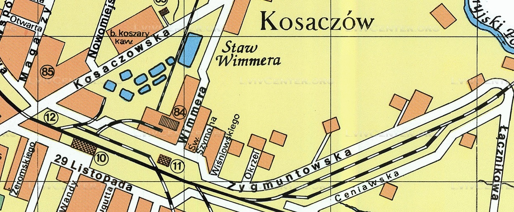

# RODZINA JUNGER

Rodzina Junger pochodzi z Kołomyi na terenie dzisiejszej Ukrainy.

W roku 1946 Anna Junger z córką Stefanią Hamaluk oraz wnuczką Halinką przenoszą się na tzw. ziemie odzyskane, czyli zamieszkują w Trzciance, gdzie dołącza do nich Edward Junger.
Dom pod adresem Konarskiego 3 w Trzciance był jednym z wielu domów opuszczonych przez Niemców zmuszonych do wyjazdu z nowych terenów polskich, i stał się docelowo nowym rodzinnym domem Jungerów.

