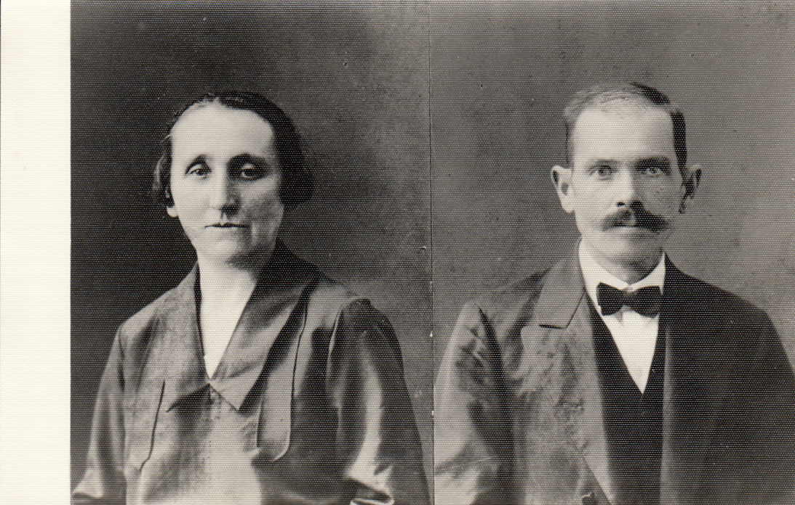

# ANNA I FRANCISZEK JUNGEROWIE

Anna Bowszek wcześnie wydana została za mąż (w wieku 17 lat) za Franciszka Jungera – ślusarza. Franciszek Junger pracował w parowozowni w Kołomyi

Anna z Franciszkiem mieli czwórkę dzieci:

- Stefania Junger
- Rudolf Junger
- Joanna Junger
- Edward Junger

W 1946r. Anna Junger przeprowadziła się ze swoją córką Stefanią oraz wnuczką Halinką do Trzcianki
Zmarła 3 marca 1965 r, pochowana na starym cmentarzu w Trzciance.

