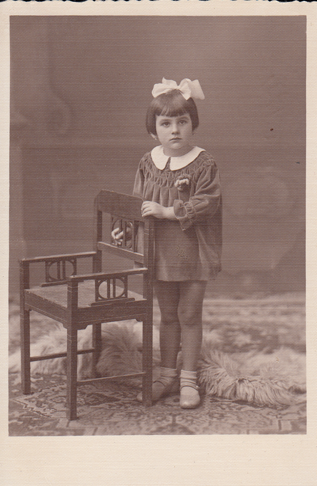

# Rudolf Junger - rodzina

Żona Rudolfa – Honorata (z domu Biesiadecka) – z ich starszą córką Lidką (po mężu: Lidia Pisarska). 

Druga córka Rudolfa i Honoraty, Janina.
Wiele lat później Jako Janina Gapińska, małżonka Czesława Gapińskiego, zamieszkała w Koszalinie. Zdjęcie datowane 7 września 1937r. 
