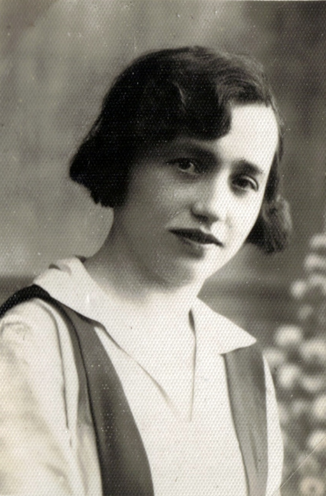

# Joanna Junger

Joanna, zwana w rodzinie Hasią, była trzecim dzieckiem Anny i Franciszka Jungerów.

Hasia, jako dorosła osoba, zamieszkała z daleka od rodzinnej Kołomyi w Dziewiętnie powiat Wilejski, gmina Żodziszki, na terenie dzisiejszej Białorusi. Zmarła bezdzietnie.

Jedyne materiały jakie zostały po jej śmierci (zdjęcia) przywiozła po jej pogrzebie siostra Stefania, po smieci Stefani zaś jej wnuczka – Alicja – przekazała materiały Renacie, córce Edwarda Jungera, która z kolei przekazała je Marii (swojej siostrze) i stąd trafiają do tego albumu.

