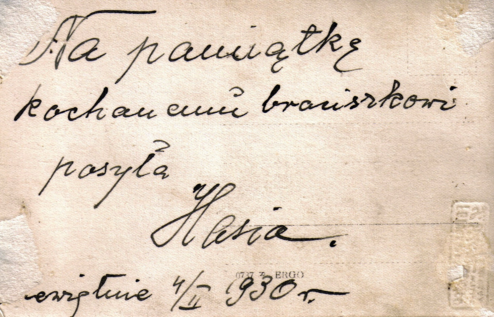

# Joanna Junger

Nie wiemy dlaczego Hasia zdecydowała wyjechać z Kołomyi i mieszkać i pracować w Dziewiętnie, leżącej 900 km dalej. To było zapewne w latach 192X, gdzie przeprowadzka do dalekiej wsi zapewne była niełatwa logistycznie

Skąd Hasia wiedziała że jest tam praca?

Co skłoniło ją do wyjazdu z w miarę nowoczesnego miasta Kołomyi do wsi „na końcu świata”?

Czy prawdą jest, że zmarła w Dziewiętne przy porodzie? 

Gdzie znajduje się jej grób, o ile jeszcze istnieje? Nie wiemy …

Na jej pogrzeb w latach 193X z rodziny pojechała wyłącznie siostra Stefania, przywożąc ze sobą heh rzeczy osobiste, włączając zdjęcia w albumie.

