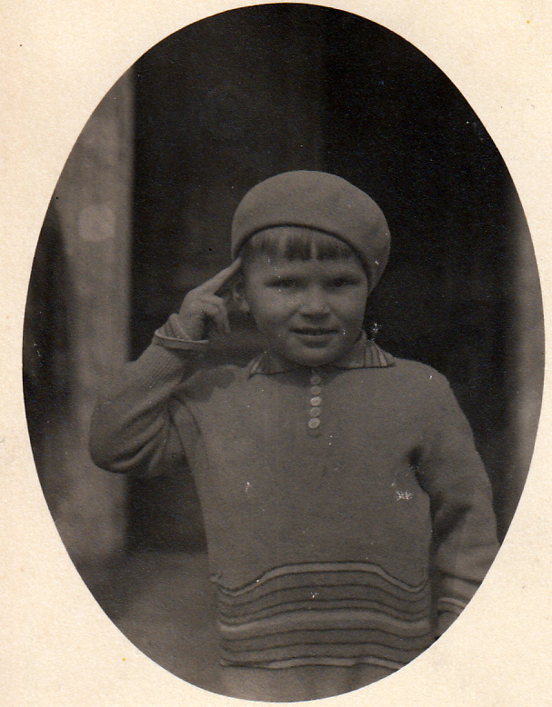
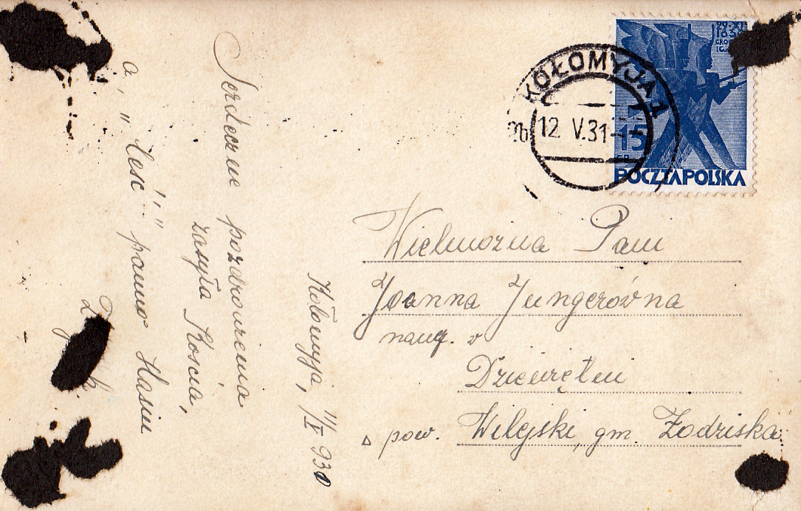

# Joanna Junger

Karta z życzeniami dla Joanny Jungerówny od jej ucznia Koscia i "Ceść" od Zbyszka (zapewne ojca tegoż ucznia), datowana 12/V/1931r.

Karta wysłana z Kołomyi powala przypuścić że Hasia wczesniej uczyła przez jakiś czas w Kołomyi zanim przeniosła się do Dziewiętni. Jej uczniowie i ich rodzice pamiętali o niej.

