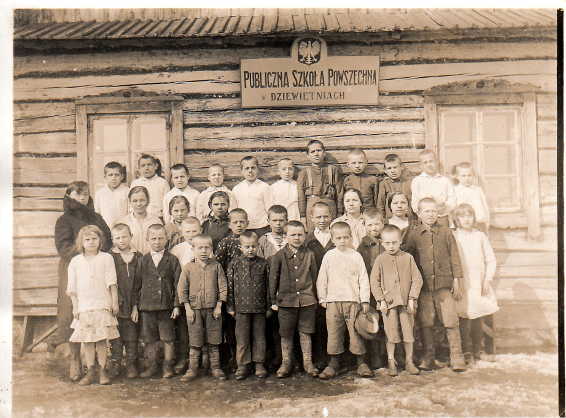
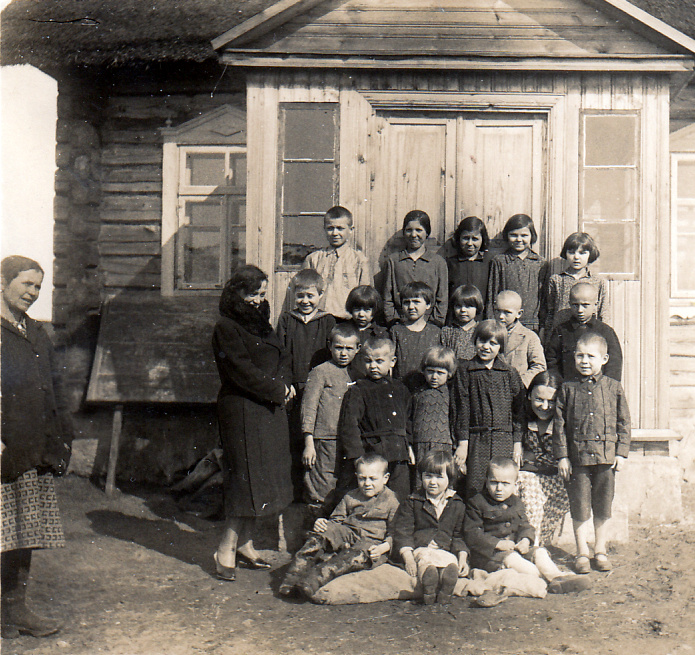

# Joanna Junger

Hasia z uczniami w Dziewiętni.

Hasia mieszkała w Dziewiętni co najmniej do 20 IV 1933, gdyż jedno ze zdjęć (nie umieszczone w albumie ze względu na niską jakość) jest podpisane ‘Dziewiętnia’ i tak datowane.

