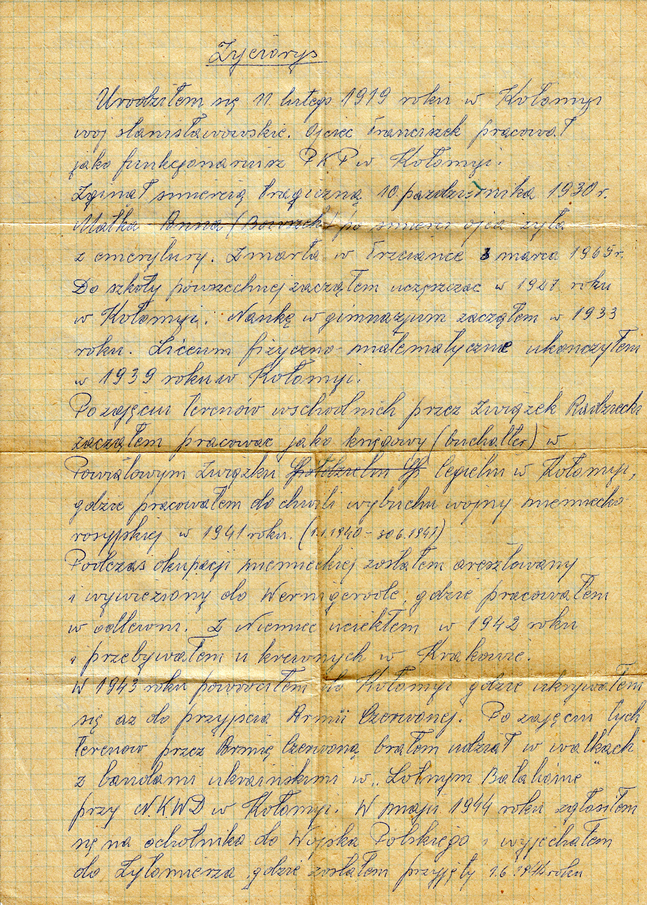

# Edward Junger

Życiorys

Urodziłem się 11 lutego 1919 roku w Kołomyi województwo Stanisławowskie. Ojciec Franciszek pracował jako funkcjonariusz PKP w Kołomyi. Zginął śmiercią tragiczną 10 października 1930 roku. Matka Anna (Bowszek) po śmierci ojca żyła z emerytury. Zmarła w Trzciance 3 marca 1965 roku. Do szkoły powszechnej zacząłem uczęszczać w 1927 roku w Kołomyi. Naukę w gimnazjum zacząłem w 1933 roku. Liceum fizyczno – matematyczne ukończyłem w 1939 roku w kołomyi.

Po zajęciu terenów wschodnich przez Związek Radziecki zacząłem pracować jako księgowy (buchalter) w Powiatowym Związku Cegielni w Kołomyi gdzie pracowałem do chwili wybuchu wojny niemiecko – rosyjskiej w 1941 roku. (1.1.1940 – 30.6.1941)

Podczas okupacji niemieckiej zostałem aresztowany i wywieziony do Wernigerode gdzie pracowałem w odlewni. Z Niemiec uciekłem w 1942 roku i przebywałem u krewnych w Krakowie.

W 1943 roku powróciłem do Kołomyi gdzie ukrywałem się aż do przyjścia Armii Czerwonej. Po zajęciu tych terenów przez Armię Czerwoną brałem udział w walkach z bandami ukraińskimi w „Lotnym Batalionie” przy NKWD w Kołomyi. W maju 1944 roku zgłosiłem się na ochotnika do Wojska Polskiego i wyjechałem do Żytomierza, gdzie zostałem przyjęty 1.6.1944 roku.

