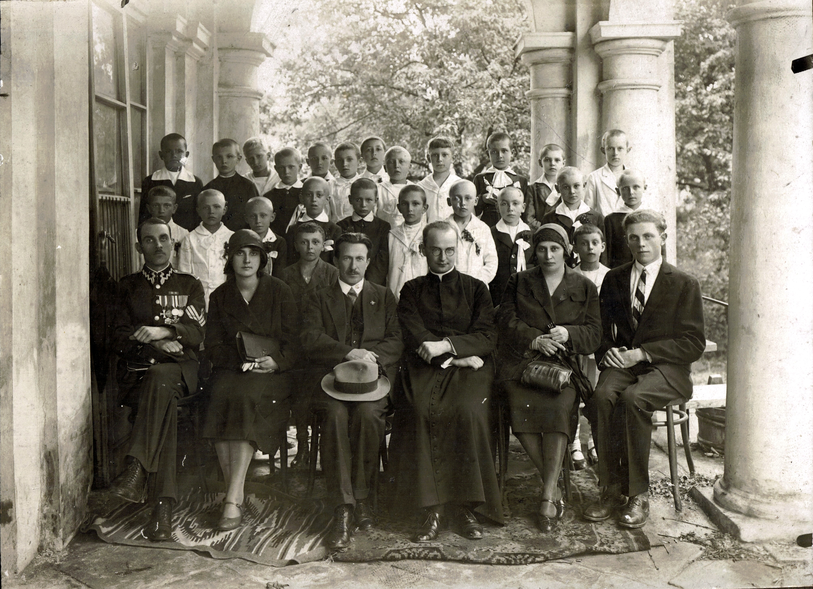

# Edward Junger

  
Powyższe zdjęcie opublikował na grupie internetowej Kołomyja Info jeden grupowicz *Mieczysław Lewandowski* z informacją *"Kołomyja. 7 czerwca 1931 r. Uroczystość Komunii Św.  Dom parafialny (zniszczony w czasie wojny). U góry Bogusława Budzianowska i Halina Sosnowska"*. Z innej informacji, na forum tej samej grupy, dowiedziałem się, że duchowny w środku to *"ks.Gwardian Eugeniusz Węgrzyn"*.  
Zdjęcie publikuję jako - w mojej ocenie - wykonane w czasie tej samej uroczystości co znajdujące się w naszych rodzinnych zbiorach, umieszczone poniżej.

---
  
Edward Junger: środkowy rząd, czwarty od prawej.
