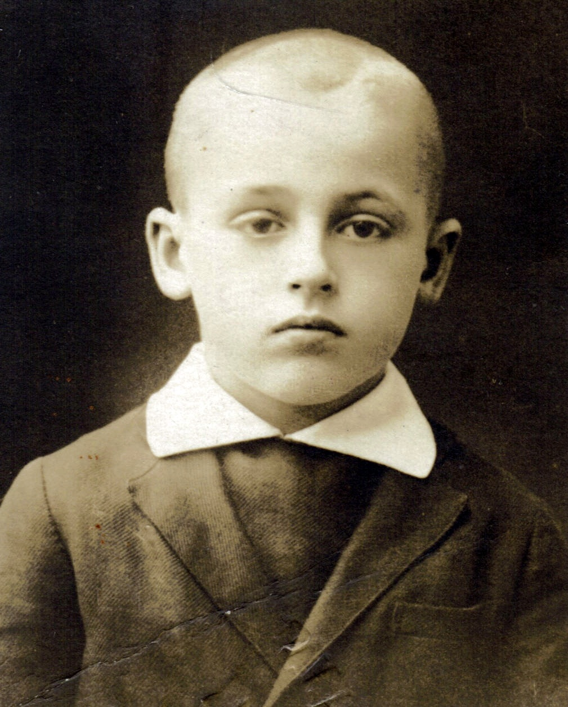
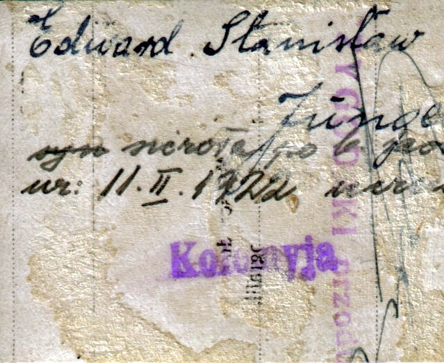
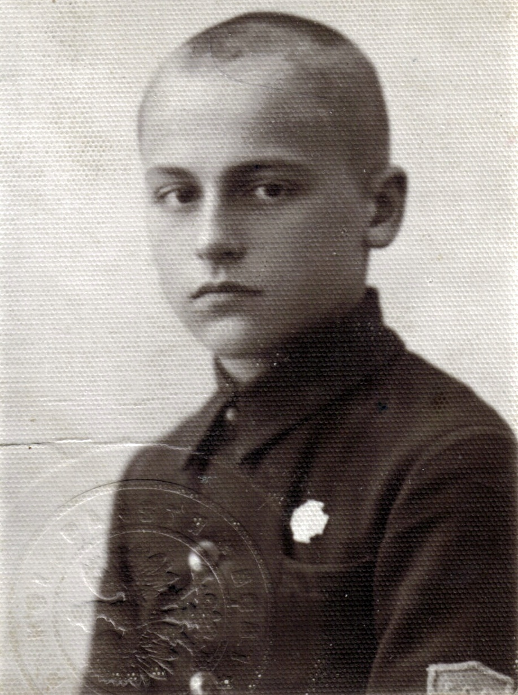
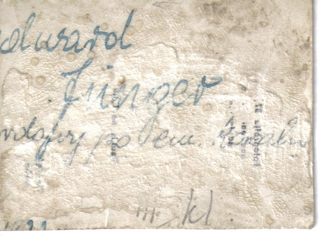

# Edward Junger

Zdjęcie nr 1, prawdopodobnie z legitymacji szkolnej.

Widzimy na drugiej stronie prawdziwą datę urodzenia: 11.II.1922.
Widzimy jego drugie imię – Stanisław
Widzimy przekreślony wyraz „syn” i zapisane obok „sierota”
Edward Junger zataił swój młody wiek aby zostać przyjęty do wojska, zmienił zatem konsekwentnie swoją datę urodzenia na 1919 rok aby się postarzeć o 3 lata. Zatem we wszystkich pozostałych dokumentach znajdziecie oficjalną datę urodzenia podaną jako 11.II.1919.

Zdjęcie nr 2

Na drugiej stronie zdjęcia prawdopodobnie napis „ … wdowy po em. kowalu” co. Włącznie z innymi informacjami pozwala domniemać że ojciec Franciszek, pracując na kolei, zajmował się pracami ślusarskimi.

