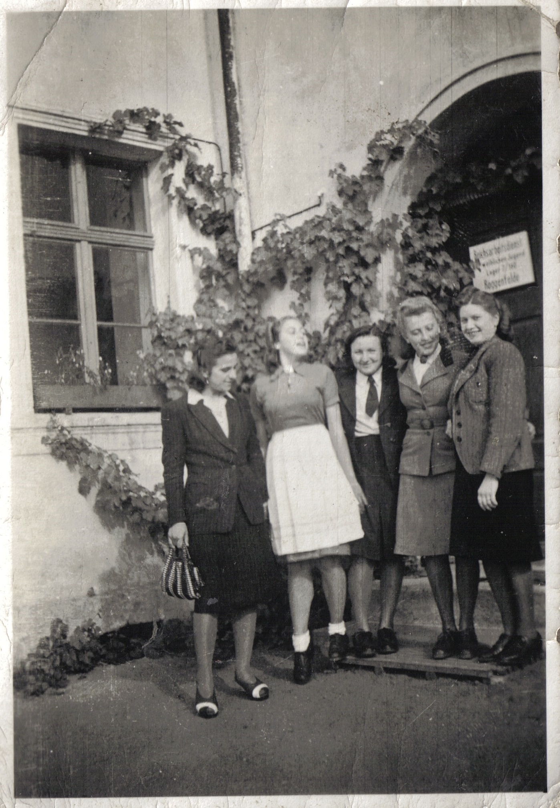
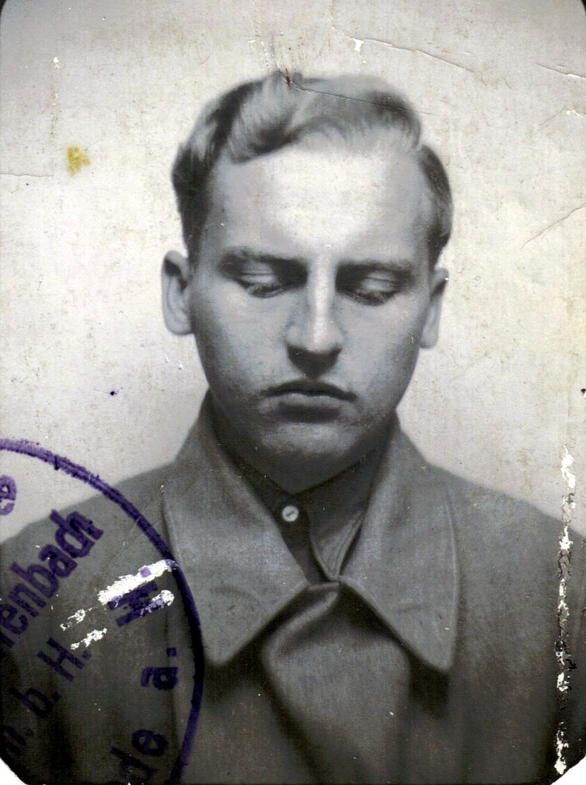

# Edward Junger

---
  
Edward Junger, aresztowany i wywieziony przez Niemców z Kołomyi do obozu Wernigerode
Pracowali w ciężkich warunkach bez ubrań ochronnych przy pracach hutniczych. Edward opowiadał że bolały go oczy od patrzenia na roztopiony metal.
Pracował kilka miesięcy, planował ucieczkę. Miało ich uciekać w sumie 7 osób.  Jednakże 6 ciu rozmyśliło i ucieczkę wykonał tylko Edward.
Ucieczka powiodła się dzięki pomocy miejscowej Niemki, widocznej na zdjęciu jako druga z prawej strony, która dostarczyła ubranie, pieniądze i dokumenty.

---

Bez przeszkód Edward dojechał prawie do Częstochowy gdzie znajdowała granica z Generalnym Gubernatorstwem. Granicę przekroczył nielegalnie koło miejscowości Herby Stare.
Podczas przekraczania strażnik dojrzał go i puścił psy w pościg. Edward przedzierał się przez głębokie rozlewiska i jeden pies płynął ciągle za Edwardem, który musiał go utopić.
