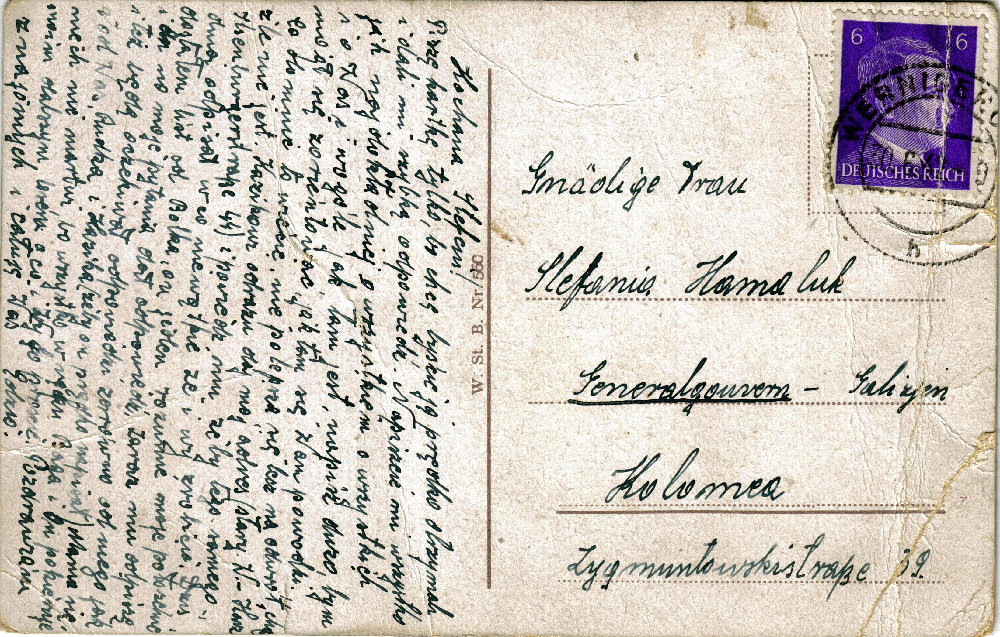

# Edward Junger

List z obozu od Edwarda do jego siostry Stefani Hamaluk, Kołomyja ul. Zygmuntowska 39, datowany 30.6.1942

Kochana Stefciu! Piszę kartkę tylko, bo chcę byście ją prędko otrzymali i dali mi szybką odpowiedź. Napiszcie mi wszystko jak najdokładniej o wszystkiem o wszystkich i o Was i w ogóle jak tam jest, napisz dużo bym mógł zorientować jak tam się Wam powodzi. Co do mnie to wiecie, nie polepsza się lecz na odwrót, choć źle nie jest. Kazikowi od razu daj mój adres (stary W. Harz Ilsenburger Straße 44) i powiedz mu żeby tego samego dnia odpisał w co nie wątpię że i wy zrobicie. Dziś dostałem list od Bolka, on jeden rozumie moje położenie i on na moje pytania dał odpowiedź. Zaraz mu odpiszę i tez będę oczekiwał odpowiedzi zarówno od niego, od Was jak i Rudka i Kazika  (żeby on prędko napisał). Mama się niech nie martwi, bo wszystko w ręku Boga i On pokieruje moim dalszym losem o co i Wy go proście. Pozdrawiam znajomych i całuję Was Edzio.

