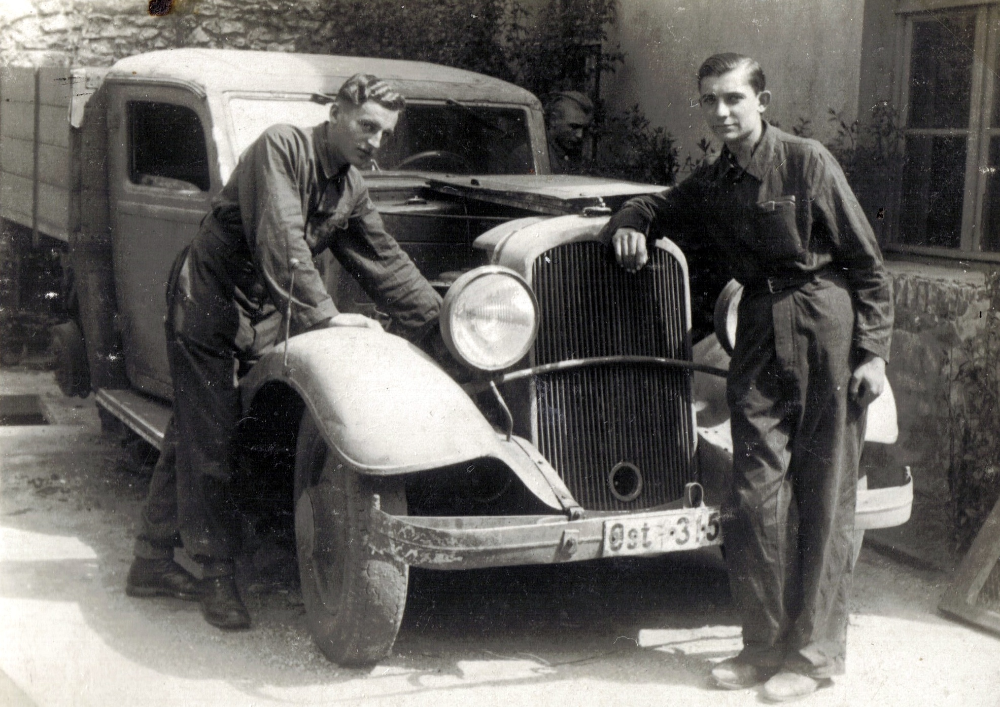

# Edward Junger

Tajemnicze zdjęcie. 1) Rejestracja wskazuje na samochód Dystryktu Lubelskiego Generalnego Gubernatora, który nie obejmował Kołomyi 2) Zdjęcie datowane po drugiej stronie na 15.V.42, kiedy w tym czasie Edward był ścigany jako uciekinier po ucieczce z Wernigerode. Wniosek: Zakładam, że data i opis nie odpowiadają treści zdjęcia.
To zdjęcie, jak i następne 4 pochodzą zapewne z tego samego okresu / miejsca - prawdopodobnie Kołomyja 1941r, po wkroczeniu Niemców, zaś przed aresztowaniem i wywózką Edwarda do Wernigerode
Na zdjęciu poniżej – Edward Junger z lewej strony.
PS: Edward na mechanice samochodowej się nie znał, więc zdjęcie zapewnie pozowane :)

