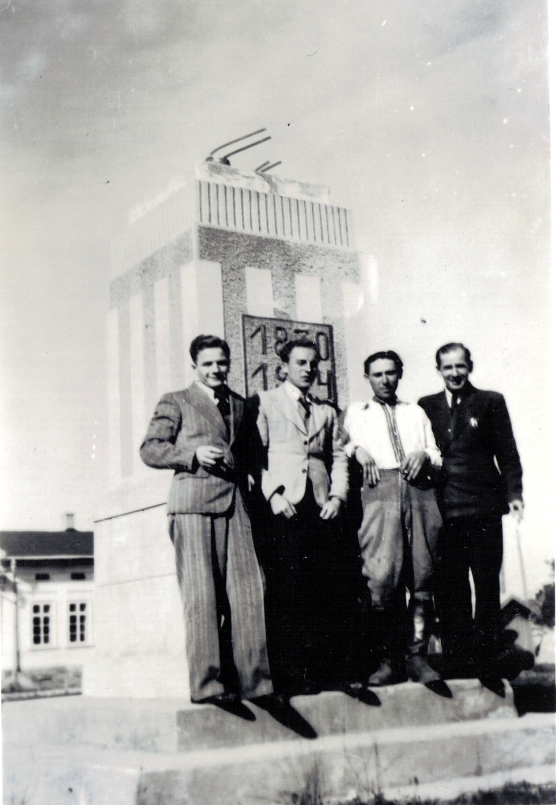

# Edward Junger

Edward drugi od lewej strony

Edward pierwszy od prawej strony. W tle budynek koszarów 49 HPS w Kołomyi, patrząc od strony Parku Miejskiego. Zgadując z lokalizacji zdjęcia, za plecami fotografa znajdować się musi pomnil Adama Mickiewicza.

