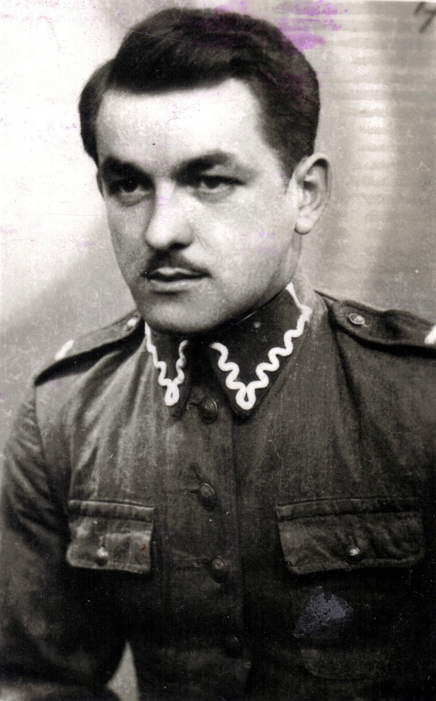
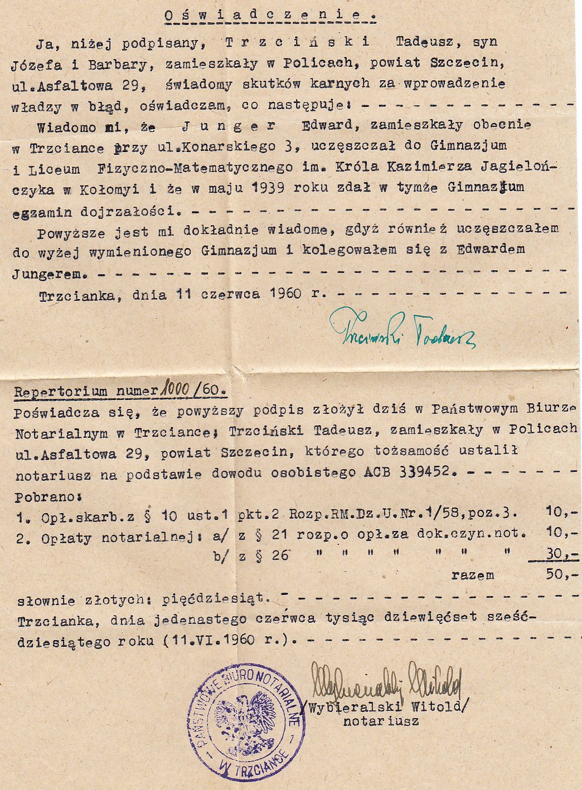

# Edward Junger

Tadeusz Trzciński, kolega Edwarda Jungera z czasów szkolnych i partyzanckich oraz wieloletni przyjaciel po czasie wojny. Ojciec chrzestny córki Edwarda – Marii.
Tadeusz oraz Edward poślubili siostry Zawiejanki z Ostrowa Wielkopolskiego – odpowiednio Henrykę oraz Halinę.

W nowo odbudowywanej Polsce poświadczenia notarialne pozwalały uzupełniać braki w dokumentach – Tadeusz Trzciński poświadcza fakt zdania przez Edwarda Jungera egzaminu dojrzałości.

