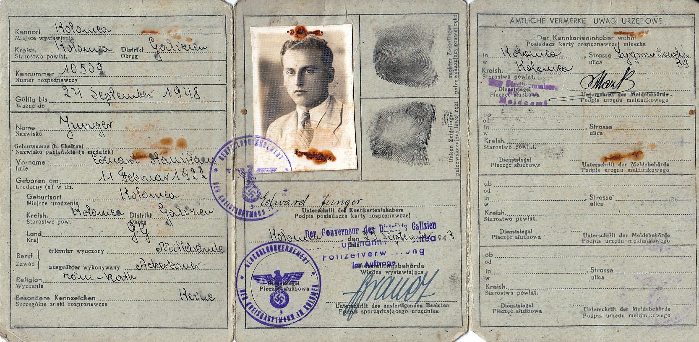

# Edward Junger

Edward nosił przy sobie kilka dowodów tożsamości – powyżej jeden z nich, oprócz którego w zachowanych dokumentach jest jeszcze jeden, nie wypełniony.
W czasie wojny kontrolujący Niemiec wyrwał Edwardowi fałszywy dokument do kontroli zanim zdołał on się przyjrzeć, który ze swoich dokumentów przedstawił. Ponieważ na każdym z nich miał nieco inne zdjęcie więc, patrząc na dokument po zdjęciu poznał jakie nazwisko ma w dokument wpisane tak, aby się przedstawić do kontroli.

