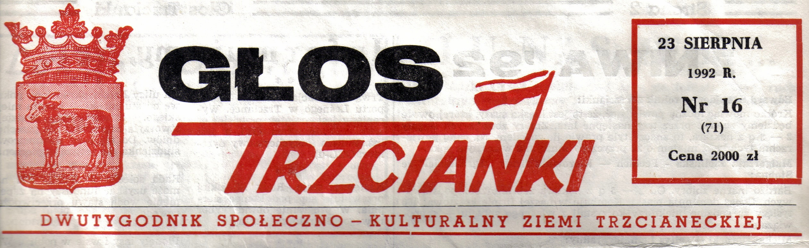
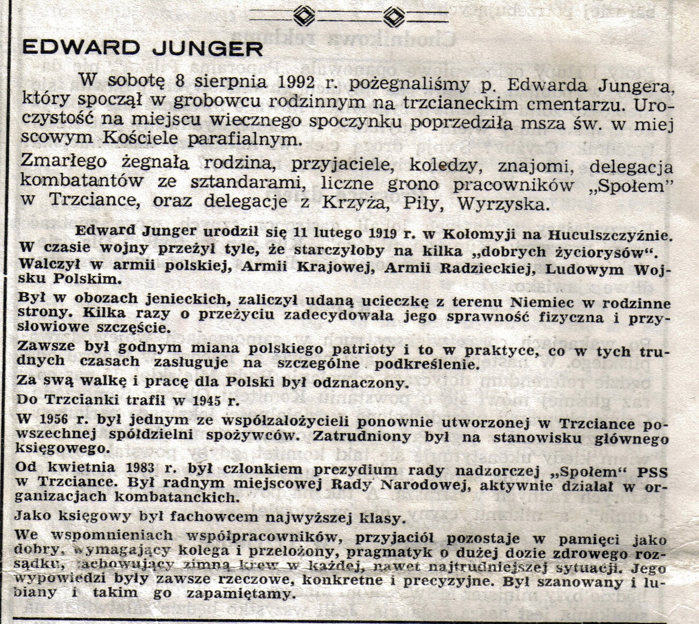

# Edward Junger

Edward Junger ginie w wypadku samochodowym 6 sierpnia 1992, kiedy kierowane przez niego auto uderza w drzewo. Pochowany w Trzciance, spoczywa obecnie w jednej kwaterze wraz ze swoją żoną Haliną.

