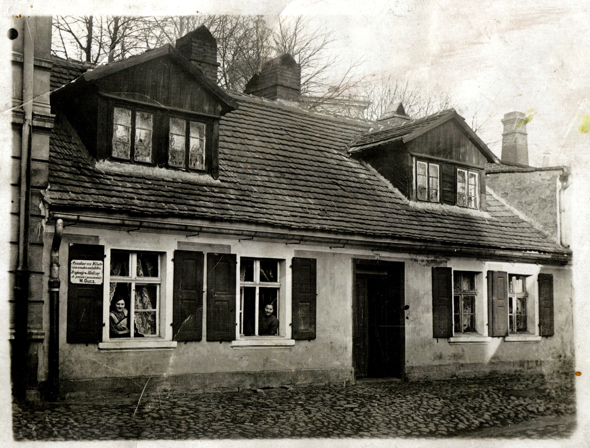

# Rodzina Zawieja

***"Człowiek żyje tak długo, aż nie zginie po nim pamięć."***

Album tematycznie obejmuje osoby i wydarzenia związane z rodziną Zawiejów zamieszkującą Ostrów Wielkopolski od lat międzywojennych.

Materiały zawarte w niniejszym albumie pochodzą głównie ze zbiorów Haliny Junger (z domu Zawieja) i są obecnie przechowywane u jej syna Jerzego Jungera. Kilka zdjęć dostarczyła Iza Kapała

Wybór zdjęć i dobór komentarzy

- Jerzy Junger [JJ] (syn Haliny Junger)
- Krystyna Muszalska [KM]
- Iza Kapała [IK] (wnuczka Mirosławy Cegły)
- Maria Siudek [MS] (córka Haliny Junger)
- Sławomir Siudek [SS] (wnuk Haliny Junger)

Dodać: Krystyna Muszalska, zmarła 29 maja 2021r., pochowana kwatera 36b/3/6 Cmentarz Centralny w Szczecinie dnia 01 czerwca 2021 roku.

## Strony 2-3

---

Ostrów Wielkopolski

W Ostrowie Wielkopolskim pod dzisiejszym adresem Plac 23 stycznia, numer domu 13 pracowała Babcia Maria Gucz z rodziną. Budynek ten (na zdjęciu z lewej strony) istnieje do dnia dzisiejszego. [SS]

Na zdjęciu:  W oknach od lewej Kazimiera Zawieja i Babcia M. Gucz. Z lewej strony na okiennicy mała reklama: Przyjmę bieliznę do prania i prasowania [SS]

“W domu tym prężyła firany Kazimiera Zawieja z córką Mirą, a trafiali się i zamożniejsi klienci, jak np. producent wędlin. Wtedy najmłodsza Krysia zanosiła firany takiemu odbiorcy, za co często była nagradzana - i tak trafiało się Krysi wrócić z wędlinami. Można więc powiedzieć, że rodzinny interes prosperował w kilku płaszczyznach” Krystyna Muszalska o swojej mamie, siostrze i sobie samej oraz o rodzinnym biznesie

---

"Orędownik Ostrowski" z dnia 20 listopada 1925r. z reklamą usług M. Gucz. Adres jest prawdopodobnie innym adresem niż widniejący na zdjęciu obok dom. [SS]

